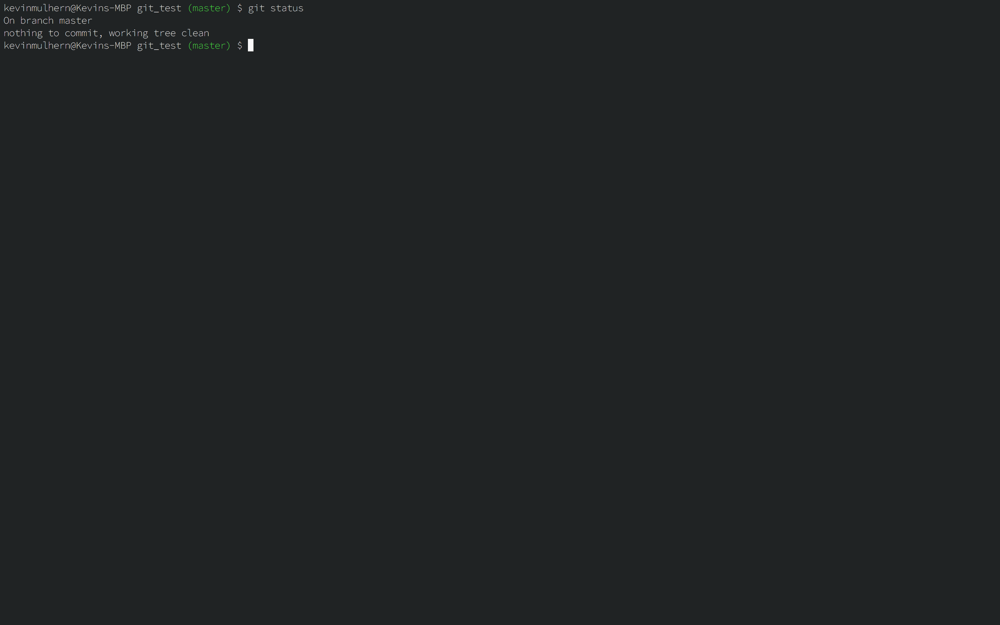

# Project: Git Basics
This short project will demonstrate how to use git to manage and archive your project folders:

1. You will set up a remote repository on GitHub and then move it down onto your local machine.
2. Once this repo is set up locally, you will be able to use git like a save button for your files and folders.
3. When you have finalised your saves you can then push your local repo up onto GitHub to share with everyone!

## Learning Outcomes
*By the end of this you should be able to:*
* Create a Git repository on GitHub and move it onto your local machine
* Describe the difference between staging and committing changes
* Describe the difference between committing your changes and pushing them onto GitHub
* Check the status of your current repository from the command line
* Look at the history of your previous commits from the command line

## Basics of Git Project
Here we will describe the basic git workflow that you will use with your projects, follow along with each of the steps.

### Create your repository on Github
1. You should have created a github account in the [installations](http://www.theodinproject.com/web-development-101/installations) project. If you haven't done that yet you can sign up [here](https://github.com/).

2. Create a new repository by clicking the button shown in the screen shot below. 

3. Give your repository the name "git_test" in the repository name input field.

4. Uncheck the "Initialize this repository with a README" option and finally create the repository by clicking the green "create repository" button at the bottom of the page.

5. This will redirect you to your new repository on GitHub. To get this repository onto your local machine copy the url in the address bar of your browser for your repository.

6. In your command line on your local machine, navigate to where you want to store this project and then clone your repository on github onto your computer with `git clone` followed by the url you copied for your repository in the last step. The full command should look something like this `git clone https://github.com/YourUsername/git_test`.

7. Thats it! You have successfully connected the repository you created on GitHub to your local machine. To test this you can `cd` into the new *git_test* folder that was downloaded with the git clone and enter `git remote -v` in your command line.

This will display the url of the repository you created in GitHub as your remote. You may have also noticed the word "origin" at the start of the `git remote -v` output. This is the name of your remote connection, it could have been named anything for example "party-parrot" or "dancing-banana" but origin is both the default and the convention. This will come up again near the end of the tutorial.

## GIT workflow
1. Create a new file in git_test called "*README.md*"

2. Type `git status in your terminal` notice your *README.md* file is in red, this means it is un-staged.

3. Type `git add README.md` this adds your *README.md* file to staging area in git.

4. Now type `git status` again, notice your file is now green.

5. Now type `git commit -m "Initial commit"`.

6. Type `git status` again once more and notice that the outputs contains "*nothing to commit*". Your changes have been committed.

## How does git save files?
A *save* in git is divided into two terminal commands: **add** and **commit**. The combination of these two commands gives you control of exactly what you want to be remembered in your snapshot.

Think of `add` as adjusting the number of people or elements to be included in your photo. While `commit` is actually taking the photo, resulting in a snapshot.

### Atomic Commits
When you start working on big projects, you will be modifying multiple files which will all need saving. However, it's best practice to save files purposefully; we call this an **atomic commit**. 

If we were to add all the files onto one stage and not think about making atomic commits, this would make your snapshot really crowded and congested - this is bad for two reasons:

First, you will not know why the snapshot was meaningful and if you wanted to find a specific snapshot you would find it difficult to trace what you were trying to accomplish with those files. 

Second, imagine if your project got corrupted or your code has a bug you can't figure out and does not work anymore. If you were to put all your files onto one stage and then tried to load a previous snapshot known to be stable, you would lose a lot of progress with your work and then piecing all the files back to their desired state would be painstaking.

To get around this, only `git add` files that are thematically similar. For example if your project had a lot of text files and image files, you could stage all text files together for one snapshot and then all image files together for another snapshot.

All snapshots taken must have a message attached to it. When you have staged files purposefully (or with a theme), it's easy to decide what kind of message to include.

To take a snapshot, you would run `git commit -m "Initial commit"`. The `-m` flag stands for message and then you include your short message in between the quotation marks: `"Initial commit"`.

## Adding another file into the mix.

1. Create a new file in the `git_test` folder and call it `hello_world.txt`.

2. In your terminal and type `git status`, notice `hello_world.txt` is un-staged.

3. Now open the *README.md* in your text editor of choice and add "This is (YourUsername)'s first git project!" and then save the file.

4. Back in your terminal enter `git status`, notice that *README.md* is now un-staged again.

5. Add *README.md* to the staging area with `git add README.md`

6. Can you guess what `git status` will output now? *README.md* will be displayed in green text while *hello_world.txt* will still be in red. This means only *README.md* has been added to the staging area.

7. Now lets add *hello_world.txt* to staging area with a different variation of add. Try `git add .` - the full stop means add all un-staged files.

8. Enter `git status` once more, everything should now been added to the staging area.

9. Finally, lets commit all of our files in the staging area and give a descriptive commit message `git commit -m "Added hello world file and added a line to README"`.

10. Enter `git status` one final time and this will output `nothing to commit`.

## Pushing your finished work to github
Finally lets upload what you have done to the Github repository you created at the start of this tutorial

1. Simply enter `git push origin master`.

2. Now enter git status once more, it should output "up to date with origin master"

## What is origin master?
As mentioned before origin is the name of your remote url of the git_test repository you set up on Github at the start of this tutorial. You can use origin to do things with your remote without having to enter the full url each time you want to do something with it. It also means you can have multiple different remotes by giving each a unique name.

`master` is the branch you want to push your changes too. We will get more into branches in a later lesson, the main thing to remember is that master is the official branch in your projects where production ready code lives.

## Additional Resources

*This section contains helpful links to other content. It isn't required, so consider it supplemental for if you need to dive deeper into something*

* More about writing [atomic commits](http://chris.beams.io/posts/git-commit/)