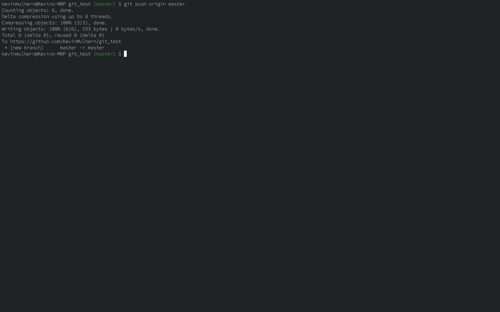

# Project: Git Basics
This short project will demonstrate how to use git to manage and archive your project folders:

1. You will set up a remote repository on GitHub and then move it down onto your local machine.
2. Once this repo is set up locally, you can begin using Git to track changes you have made to the files in your project.
3. When you have finalised your saves you can then push your local repo up onto GitHub to share with everyone!

## Basics of Git Project
Here we will describe the basic git workflow that you will use with your projects, follow along with each of the steps.

### Create your repository on Github
1. You should have created a github account in the [installations](http://www.theodinproject.com/web-development-101/installations) project. If you haven't done that yet you can sign up here [github](https://github.com/)

2. Create a new repository by clicking the button shown in the screen shot below.

3. Give your repository the name "git_test" in the repository name input field.

4. Check the "Initialize this repository with a README" option and finally create the repository by clicking the green "create repository" button at the bottom of the page.

5. This will redirect you to your new repository on github. To get this repository onto your local machine copy the url in the address bar of your browser for your repository.

6. In your command line on your local machine navigate to where you want to store this project and then clone your repository on github onto your computer with `git clone` followed by the url you copied for your repository in the last step. The full command should look something like this `git clone https://github.com/YourUsername/git_test`.

7. Thats it, you have successfully connected the repository you created on github to your machine. To test this you can `cd` into the new git_test folder that was downloaded with the git clone and enter `git remote -v` in your command line.

This will display the url of the repository you created in github as your remote. You may have also noticed the word "origin" at the start of the `git remote -v` output. This is the name of your remote connection, it could have been named anything for example "my awesome remote" or "banana hammock" but origin is the convention. This will come up again near the end of the tutorial.

## GIT workflow
1. Create a new file in git_test called "hello_world.txt"

2. type `git status in your terminal` notice your hello_world.rb file is in red, this means it is un-staged.

3. type `git add hello_word.txt` this adds your hello_world.txt file to staging area in git.

4. now type `git status` again, notice your file is now green.

5. now type `git commit -m "Initial commit"`.

6. Type `git status again` once more and notice  the outputs contains "nothing to commit". Your changes have been committed.

##How does git save files?
A *save* in git is divided into two terminal commands: **add** and **commit**. The combination of these two commands gives you control of exactly what you want to be remembered in your snapshot.

###The staging Area
Think of `add` as adjusting the number of people or elements to be included in your photo.

With Git you choose the changes you want to save with `git add`. Imagine a project that contains multiple files and you have made changes to several of them. You want to save some of the changes you have made and leave some other changes to continue working on them.

###Committing
Think of `commit` as actually taking the photo, resulting in a snapshot.

We used this command to commit the hello_world.txt file `git commit -m "Initial commit"` the `-m` flag stands for message and must always be followed by a message in quotes in our case `"Initial commit"`.

## Adding another file into the mix.

1. Create a new file in the `git_test` folder and call it `hello_mars.txt`.

2. In your terminal and type `git status`, notice `hello_mars.txt` is un-staged.

3. Now open the `hello_word.txt` in your text editor of choice and add "Inside the hello world file" and then save the file.

4. Back in your terminal enter `git status`, notice that `hello_word.txt` is now un-staged again.

5. Add `hello_word.txt` to the staging area with `git add hello_word.txt`

6. Can you guess what `git status` will output now? `hello_word.txt` will be displayed in green text and `hello_mars.txt` will still be in red. This means only `hello_world.txt` has been added to the staging area.

7. Now lets add `hello_mars.txt` to staging area with a different variation of add `git add .` this full stop means add all un-staged files.

8. Enter `git status` once more, everything has now been added to the staging area.

9. Finally lets commit all of our changes `git commit -m "Added hello mars file and added a line to hello world"`

10. Enter `git status` once more, this will output `nothing to commit`.

11. Now lets commit both everything in the staging area and give it a descriptive commit message `git commit -m "added hello_mars.txt and edited hello world"`

12. Enter `git status` one final time.

## Pushing your finished work to github
Finally lets upload what you have done to the Github repository you created at the start of this tutorial

1. simply enter `git push origin master`.

2. Now enter git status once more, it should output "up to date with origin master"

## What is origin master?
As mentioned before origin is the name of your remote url of the git_test repository you set up on Github at the start of this tutorial. You can use origin to do things with your remote without having to enter the full url each time you want to do something with it. It also means you can have multiple different remotes by giving each a unique name.

`master` is the branch you want to push your changes too. We will get more into branches in a later lesson, the main thing to remember is that master is the official branch in your projects where production ready code lives.

## Cheatsheet
Here is a reference list of commands you will need to know and remember:

* Commands related to remote repository:
  * `git clone https://github.com/user-name/repository-name.git`
  * `git push origin master`
* Commands related to workflow:
  * `git add .`
  * `git commit -m "A message describing what you have done to make this snapshot different"`
* Commands related to checking status or log history
  * `git status`
  * `git log`

The git syntax works like this: `program | action | destination`.

For example:
* `git add .` is read like `git | add | .`
* `git commit -m "message"` is read like `git | commit -m | "message"`
* `git status` is read like `git | status | (no destination)`

## Additional Resources

*This section contains helpful links to other content. It isn't required, so consider it supplemental for if you need to dive deeper into something*
