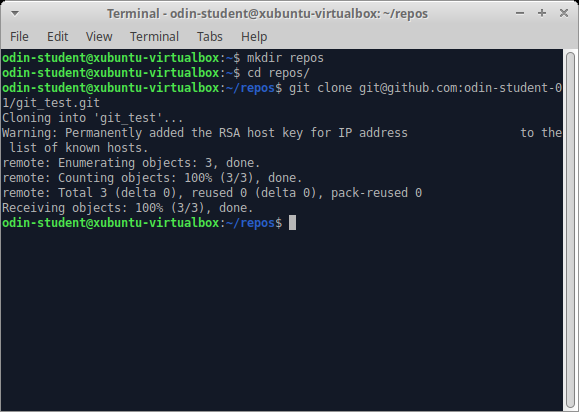

### Introduction

In this lesson, we'll cover common Git commands used to manage your projects and to upload your work onto GitHub. We refer to these commands as the **basic Git workflow**. When you're using Git, these are the commands that you'll use 70-80% of the time, so if you can get these down, you'll be more than halfway done mastering Git!

### Learning Outcomes
By the end of this lesson, you should be able to do the following:

 - Create a Git repository on GitHub and copy it onto your local machine.
 - Explain the two-stage system that Git uses to save files.
 - Describe the difference between staging and committing changes.
 - Describe how to upload your work to GitHub using Git.
 - Describe the difference between committing your changes and pushing them onto GitHub.
 - Explain how to check the status of your current repository from the command line.
 - Explain how to look at the history of your previous commits from the command line.

### Assignment

#### Before you start!
- Recent changes to the way Github names the default branch means you need to make sure you are using a recent version of git (2.28 or later). You can check your version by running:
`git --version`
- If you haven't already, set your local default git branch to `main`. You can do so by running:
`git config --global init.defaultBranch main`
- For more information on the change from `master` to `main` see [GitHub's Renaming Repository](https://github.com/github/renaming).

#### Create the Repository

1. You should have already created a GitHub account in the [Setting up Git](https://www.theodinproject.com/courses/foundations/lessons/setting-up-git) lesson. If you haven't done that yet, you can sign up [here](https://github.com/).

2. Create a new repository by clicking the button shown in the screenshot below.
  
3. Give your repository the name "git_test" in the repository name input field, check "Add a README file", and create the repository by clicking the green "Create repository" button at the bottom of the page.
  
4. This will redirect you to your new repository on GitHub. To get ready to copy (clone) this repository onto your local machine, click the green "Code" button, select the SSH option and copy the line below to it.
  
5. In the command line on your local machine, let's make a new directory for all your Odin projects to go. Create a directory called `repos` with the `mkdir` command in your root folder. If you're not sure you're in your root folder, just type `cd ~`. Once it's made, move into it with the `cd` command.
  
6. Now it's time to clone your repository from GitHub onto your computer with `git clone` followed by the URL you copied in the last step. The full command should look similar to `git clone git@github.com:USER-NAME/REPOSITORY-NAME.git`.
  
7. That's it! You have successfully connected the repository you created on GitHub to your local machine. To test this, you can `cd` into the new **git_test** folder that was downloaded and then enter `git remote -v` in your command line. This will display the URL of the repository you created in GitHub, which is the remote for your local copy. You may have also noticed the word **origin** at the start of the `git remote -v` output, which is the name of your remote connection. The name "origin" is both the default and the convention for the remote repository, but it could have just as easily been named "party-parrot" or "dancing-banana". (Don't worry about the details of origin for now; it will come up again near the end of this tutorial.)
  

#### Use the Git Workflow

1. Create a new file in the `git_test` folder called "hello_world.txt" with the command `touch hello_world.txt`.
  
2. Type `git status` in your terminal. In the output, notice that your hello_world.txt file is shown in red, which means that this file is not staged.
  
3. Type `git add hello_world.txt`. This command adds your hello_world.txt file to the staging area in Git. The staging area is part of the two-step process for making a commit in Git. Think of the staging area like a "waiting room" for your changes until you commit them. Now, type `git status` again. In the output, notice that your file is now shown in green, which means that this file is now in the staging area.
  
4. Type `git commit -m "Add hello_world.txt"` and then type `git status` once more. The output should now say: "*nothing to commit, working tree clean*", indicating your changes have been committed. Don't worry if you get a message that says "*upstream is gone*", this is totally normal and only showing because your cloned repository currently has no branches. It will be resolved once you have followed the rest of the steps in this project.
  
5. Type `git log` and look at the output. You should see an entry for your "*Add hello_world.txt*" commit. You will also see details on the author who made the commit and the date and time for when the commit was made. If your terminal is stuck in a screen with (END) at the bottom, just press "q" to escape. You can configure settings for this later, but don't worry about it too much for now.

#### Modify a file or two

1. Open README.md in your text editor of choice. In this example we will opening the directory in Visual Studio Code.
  
2. Add "Hello Odin!" to line 3 of README.md and save the file with "Ctrl+S".
  
3. Back in your terminal (or in the fancy built-in terminal in Visual Studio Code with *Ctrl + \`* ), type `git status` and notice that README.md is now shown as modified, and not staged or commited. This is because you made a change to it, and it is already a tracked file.
  
4. Add README.md to the staging area with `git add README.md`.
5. Can you guess what `git status` will output now? README.md will be displayed in green text. That means README.md has been added to the staging area. The file hello_world.txt will not show up because it has not been modified since it was commited.
  
6. Open hello_world.txt, add some text to it, save and stage it. You can use `git add .` to add all files **in the current directory** to the staging area, or even `git add -A` to add ALL unstaged files to the staging area within the repository. Then, type `git status` once more, and everything should now be in the staging area.
  
7. Finally, let's commit all of the files that are in the staging area and add a descriptive commit message. `git commit -m "Edit README.MD and hello_world.txt"`. Then, type `git status` once again, which will output "*nothing to commit*".
  
8. Take one last look at your commit history by typing `git log`. You should now see two entries.

#### Push Your Work to GitHub

Finally, let's upload your work to the GitHub repository you created at the start of this tutorial.

1. Type `git push origin main`.
  
2. Type `git status` one final time. It should output "*nothing to commit, working tree clean*".
  
3. When you reload the repository on GitHub, you should see the README.md and hello_world.txt files that you just pushed there from your local machine.
 

### Cheatsheet

This is a reference list of the most commonly used Git commands. (You might consider bookmarking this handy page.) Try to familiarize yourself with the commands so that you can eventually remember them all:

* Commands related to a remote repository:
  * `git clone git@github.com:USER-NAME/REPOSITORY-NAME.git`
  or
  `git clone https://github.com/user-name/repository-name.git`
  * `git push origin main`
* Commands related to workflow:
  * `git add .`
  * `git commit -m "A message describing what you have done to make this snapshot different"`
* Commands related to checking status or log history
  * `git status`
  * `git log`

The basic Git syntax is `program | action | destination`.

For example,

* `git add .` is read as `git | add | .`, where the period represents everything in the current directory;
* `git commit -m "message"` is read as `git | commit -m | "message"`; and
* `git status` is read as `git | status | (no destination)`.

### Conclusion
You may not feel completely comfortable with Git at this point, which is normal. It's a skill that you will get more comfortable with as you use it.

The main thing to take away from this lesson is the **basic workflow**. The commands you've learned here are the ones you will be using the most often with Git.

Don't worry if you don't know all the commands yet or if they aren't quite sticking in your memory yet. They will soon be seared into your brain as you use them over and over in future Odin projects.

In later Git lessons, we will cover some of the more advanced Git features, such as branches, which will further expand your abilities and make you more productive.

For now, concentrate on using the basics of Git that you've learned here with all of your projects from now on. You will soon know each of the basic Git commands from memory!

### Additional Resources
This section contains helpful links to other content. It isn't required, so consider it supplemental for if you need to dive deeper into something.

* [Learn Enough Git to Be Dangerous](https://www.learnenough.com/git-tutorial) is an introductory guide on Git by [Michael Hartl](http://www.michaelhartl.com/).
* An easy-to-read, pragmatic guide to using Git is available for free on [Kindle](https://www.amazon.com/Rys-Git-Tutorial-Ryan-Hodson-ebook/dp/B00QFIA5OC).
* The [Git Cheat Sheet](https://education.github.com/git-cheat-sheet-education.pdf) from GitHub provides quick instructions for using common commands (you can find a webpage version [here](https://github.github.com/training-kit/downloads/github-git-cheat-sheet/)).
* [Atlassian](https://www.atlassian.com/git/tutorials/what-is-version-control) has a very thorough and well laid out Git tutorial.
* [This video](https://youtu.be/HkdAHXoRtos) by Jeff Delaney has a fast-paced overview of Git.
* For a more in-depth understanding of Git, read the free [ProGit eBook](https://git-scm.com/book/en/v2).
* [Learn Git Branching](https://learngitbranching.js.org/) is an interactive website to learn the basics of git branching by [Thomas Rokicki](https://github.com/CraftingGamerTom)
* [How to Write a Git Commit Message](https://chris.beams.io/posts/git-commit/) by [Chris Beams](https://github.com/cbeams) provides guidelines for writing neat and concise commit messages.

### Knowledge Check
This section contains questions for you to check your understanding of this lesson. If you’re having trouble answering the questions below on your own, review the material above to find the answer.

* <a class="knowledge-check-link" href="#new-github-repo">How do you create a new repository on GitHub?</a>
* <a class="knowledge-check-link" href="#github-to-local">How do you copy a repository onto your local machine from GitHub?</a>
* <a class="knowledge-check-link" href="#default-remote">What is the default name of your remote connection?</a>
* <a class="knowledge-check-link" href="#origin-push">Explain what `origin` is in `git push origin main`.</a>
* <a class="knowledge-check-link" href="#main-push">Explain what `main` is in `git push origin main`.</a>
* <a class="knowledge-check-link" href="#two-stages">Explain the two-stage system that Git uses to save files.</a>
* <a class="knowledge-check-link" href="#git-status">How do you check the status of your current repository?</a>
* <a class="knowledge-check-link" href="#git-add">How do you add files to the staging area in git?</a>
* <a class="knowledge-check-link" href="#git-commit">How do you commit the files in the staging area and add a descriptive message?</a>
* <a class="knowledge-check-link" href="#git-push">How do you push your changes to your repository on GitHub?</a>
* <a class="knowledge-check-link" href="#git-log">How do you look at the history of your previous commits?</a>
