### Guide: Virtual Machine installation

Installing a Virtual Machine (VM) is the easiest and most reliable way to get started creating an environment for web development. A VM is an entire computer emulation that runs inside your current Operating System (OS), like Windows. The main drawback of a VM is that it can be slow because you're essentially running two computers at the same time. We'll do a few things to improve its performance.

### Step 1: Download VirtualBox and Xubuntu

Installing a VM is a straightforward process. This guide uses Oracle's VirtualBox program to create and run the VM. This program is open-source, free, and easy to use. What more can you ask for? Now, let's make sure we have everything downloaded and ready for installation.

<div class="lesson-note lesson-note--warning" markdown="1">

#### Use only your VM for The Odin Project

Once you have completed these instructions, **you are expected to work entirely in the VM.** Maximize the window, add more virtual monitors if you have them, fire up the Internet Browser in the **Whisker Menu**  on the top left of the desktop. You should not be using anything outside of the VM while working on The Odin Project. If you feel like you have a good understanding after using the VM for a while, and or want to improve your experience, we recommend dual-booting Ubuntu, which there are instructions for below.

</div>

#### Step 1.1: Download VirtualBox

[Download VirtualBox for Windows hosts](https://www.virtualbox.org/wiki/Downloads).

#### Step 1.2: Download Xubuntu

There are thousands of distributions of Linux out there, but Xubuntu is undoubtedly one of the most popular and user friendly. When installing Linux on a VM, we recommend downloading [Xubuntu](https://xubuntu.org/release/24.04/). Click on the `Direct Downloads` button, find your nearest server location and click on it. There are a few files listed here, download the one ending in `.iso`, which will also be the largest one (around 4 gigabytes). Xubuntu uses the same base software as Ubuntu but has a desktop environment that requires fewer computer resources and is therefore ideal for virtual machines. If you find the download speed slow, you can download the [Xubuntu `.iso` directly from the official Ubuntu image server](https://cdimage.ubuntu.com/xubuntu/releases/noble/release/), as the previous link points to a US-based server.

If you reach the download page and are unsure about what version to choose, it is recommended that you pick the Long-Term Support (LTS) version 24.04 (Noble Numbat). You may be tempted to choose a more recent release, but this version is tried and tested by the Odin Project community and therefore the most reliable option for the purposes of this curriculum.

### Step 2: Install VirtualBox and set up Xubuntu

#### Step 2.1: Install VirtualBox

Installing VirtualBox is very straightforward. It doesn't require much technical knowledge and is the same process as installing any other program on your Windows computer. Double clicking the downloaded VirtualBox file will start the installation process.

<div class="lesson-note lesson-note--tip" markdown="1">

#### Microsoft Visual C++ 2019

If you receive an error about needing Microsoft Visual C++ 2019 Redistributable Package, you can find it on the [official Microsoft Learn page](https://learn.microsoft.com/en-us/cpp/windows/latest-supported-vc-redist?view=msvc-170#visual-studio-2015-2017-2019-and-2022). You most likely want the version with `X64` Architecture (that means 64-bit) - download and install it then try installing VirtualBox again.

</div>

During the installation, you'll be presented with various options. We suggest dropping the Python Support as you don't need it by clicking on the drive icon with an arrow and choosing **Entire feature will be unavailable**:

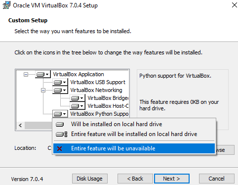

This is how your installation window should look like after turning it off:

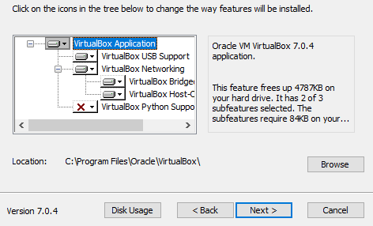

You do not have to exclude Python Support. It is an optional package to allow for automation Virtual Machines with VirtualBox, which is out of scope for this curriculum, and we simply do not want you to install more than what you have to.

Make sure you install the application on `C:` drive, as it has tendency to error out otherwise. The virtual machine itself can be installed anywhere but we'll get to that soon.
As the software installs, the progress bar might appear to be stuck; just wait for it to finish.

#### Step 2.2: New Virtual Machine

Now that you have VirtualBox installed, launch the program. Once open, you should see the start screen. Click on the **New** button to create a virtual operating system.

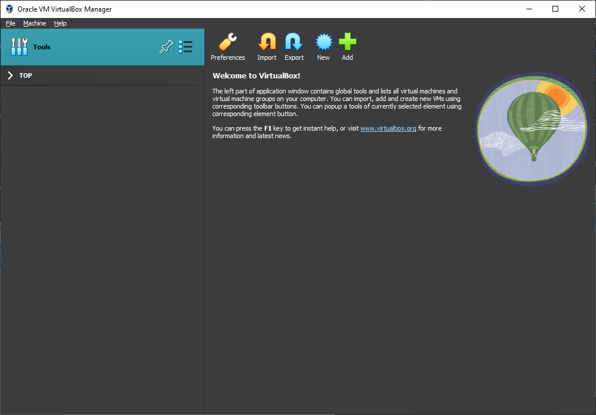

Give it a name of **Xubuntu-TOP**. If you want the VM installed somewhere else than default `C:` location, change that accordingly in the **Folder** option. This is the place where your virtual disk will reside, so make sure that you've got at least 30GB for that. In **ISO Image** choose **Other** - you'll see a window open for you to find the `.iso` file on your PC. It most likely is in the `Downloads` folder.

**Uncheck "Proceed with Unattended Installation".** This feature does not work and you will not be able to control your installation. If you do enable it accidentally before installing just delete your VM and try again.

The fields should auto populate once you enter the VM Name.

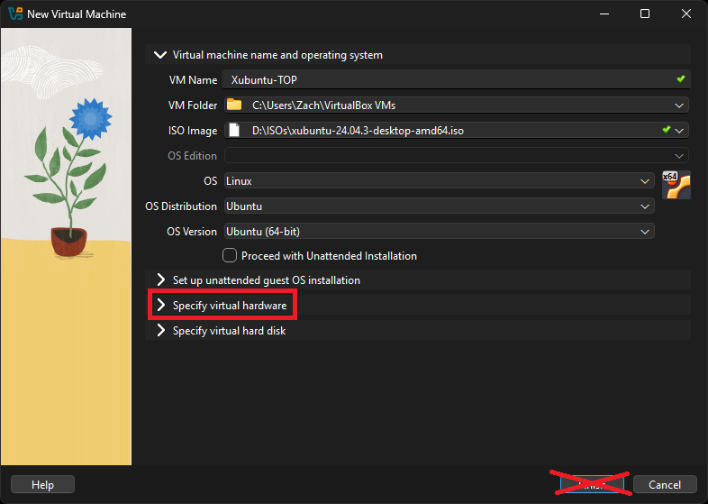

Do **not** click Finish yet! We're not done. Continue the setup process by pressing the **Specify virtual hardware** accordion and follow the next steps.

#### Step 2.3: Specify Virtual Hardware

You should see a window like this one now:

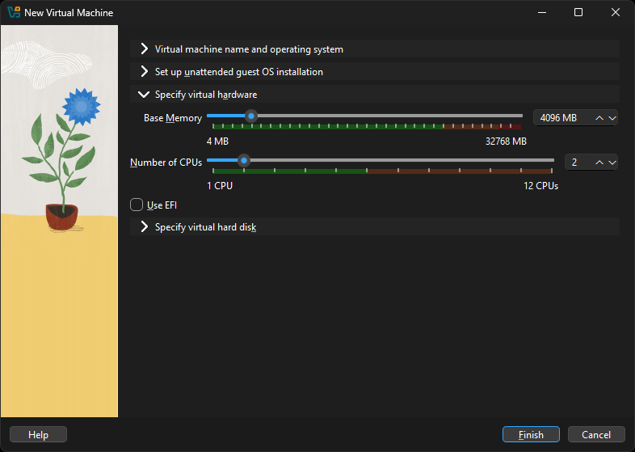

In the **Hardware** section of the installation you want to set your **Base Memory** to at least 2048 MB or more if possible - the upper limit is half of your total RAM but 4096 MB with the settings we recommend should give you a smooth experience.

> For example, if you have 8 GB (8192 MB respectively) of RAM, you could allocate up to 4096 MB (1024 MB to 1 GB) to your VM's operating system. You can Google how to find out how much RAM you have available if you do not know this already. If the VM runs a bit slow, try allocating more memory!

<div class="lesson-note lesson-note--tip" markdown="1">

#### Converting gigabytes to megabytes

Difficulty converting your Gigabytes (GB) into Megabytes (MB)? 1 GB of RAM is equal to 1024 MB. Therefore, you can say that **8 GB = 8 x 1024 = 8192 MB.**

</div>

As for **Processors** you want this to be at 2 and no more. Leave **Use EFI** uncheck.

We're still not ready for the Finish button yet. Click the **Specify virtual hard disk accordion** to continue.

#### Step 2.4: Specify Virtual Hard Disk

Now, you want to leave all the settings as they are besides the **Disk Size**, we recommend giving the VM **at least 30GB** of space. Reminder that this disk will be created in the folder that you've specified on the very first step of the VM creation process but nonetheless, the disk can be moved and increased in the future if needed.

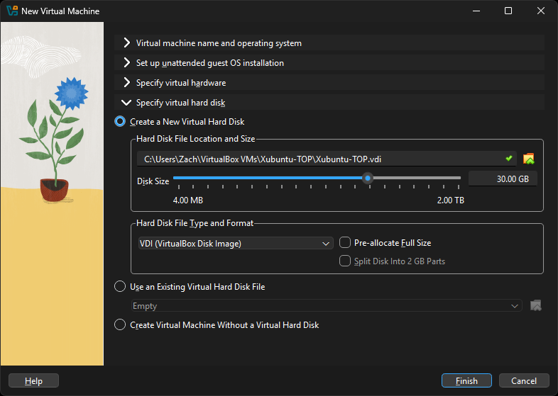

We are now ready to hit **Finish**. Please do so.

#### Step 2.5: Virtual Video RAM

One last step is required before we start up the Virtual Machine and start the installation process. Please click on the **Settings** button.

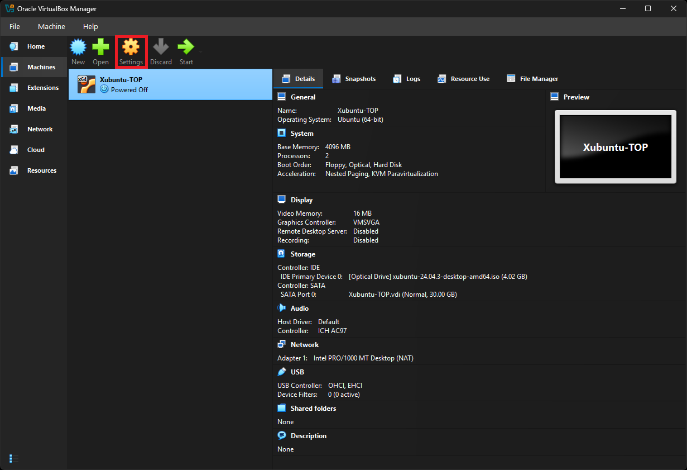

The Settings page for your Virtual Machine will open and look like the image below.

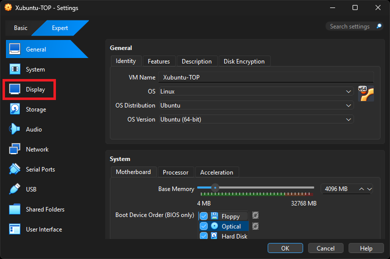

Please click on the **Display** button. You will then be on the Display settings screen. What you must do here is increase the **Video Memory** to maximum. You can also increase the number of Virtual Monitors if you have multiple physical monitors. We recommend to do this later once you are comfortable in your VM.

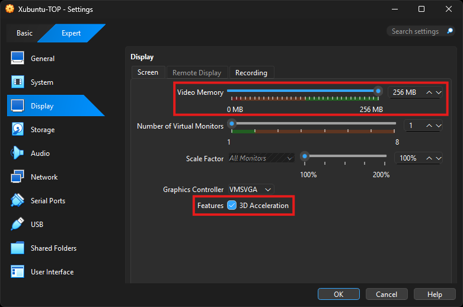

Click **OK**. Now we're ready to begin the installation.

### Step 3: Begin Xubuntu installation

You should find yourself back on the start screen. Click the **Start** button with your VM selected. If you accidentally open the dropdown for the Start button you can click **Start with GUI**, or click the Start button again. Another way to start your VM is by double-clicking the VM itself!

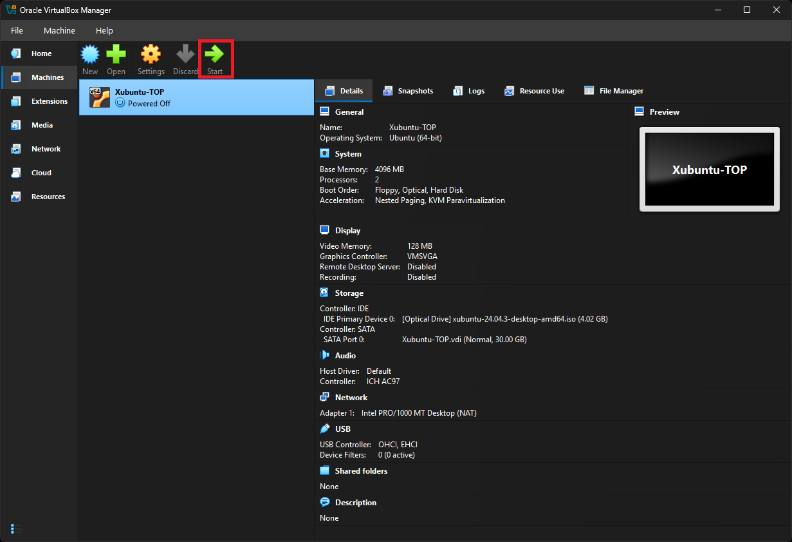

A new window should appear that shows some images to indicate that you are loading an Oracle Virtual Machine. It will then transition to a start screen for Xubuntu called the GRUB Boot Menu. By default you have 30 seconds to choose an option by using the arrow keys and selecting via Enter. Typically the default option selected is the one you want, and in this case it's **Try or Install Xubuntu**. If you choose the wrong option just end the VM by clicking File and Close, or hitting the X button, and choosing **Power off the machine**.

And yes, the screen will be small at this point. We will fix that later.

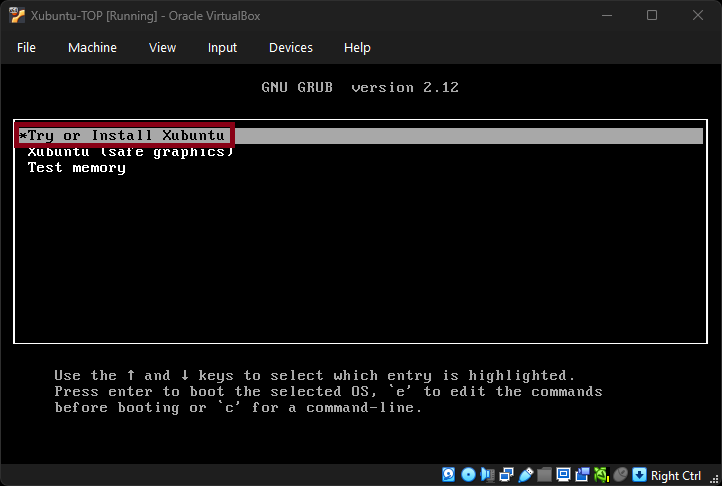

You should then see some console text show on the screen show up and disappear, and eventually make it to the Xubuntu desktop screen.

This is a temporary environment called a Live Desktop. Any changes you make here (besides installing the operating system on the VM) are not permanent.

To continue double click on the **Install Xubuntu** desktop icon.


Another window should open titled *Welcome to Xubuntu*. Select your language and click **Next**.

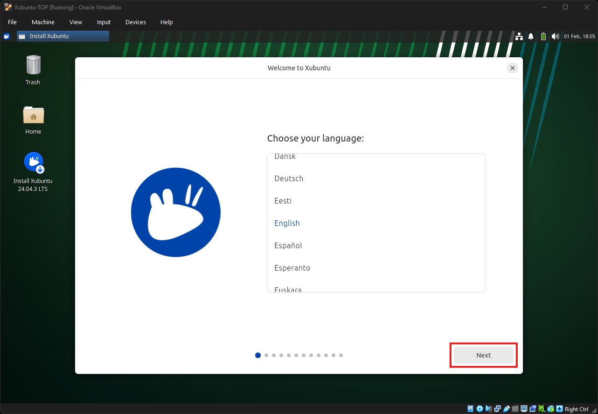

The next screen will ask you to *Select your keyboard layout*. You can optionally type in the input field to test and make sure your selection is correct. Do so and click **Next**.


The next screen will ask you to configure your settings so you can *Connect to the internet*. This is not necessary to change because VirtualBox is configured to use your host machines network device, so whether the VM knows you're wired or wireless it **does not matter**, to it you are essentially hard wired to the internet.

> **Note for VPN Users**: If you are unable to continue with the installation or run updates because your VM seemingly cannot connect to the internet **and** you're using a VPN, consider whitelisting your VM, use a reverse split tunnel, or temporarily disable it all together. If split tunnel does not work try setting the VM Network Adapter to *Bridged Adapter* and try again.

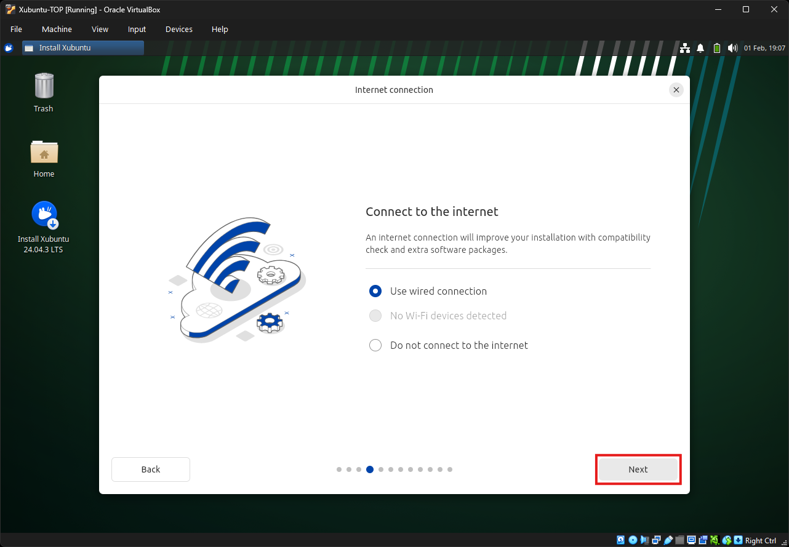

The next screen will ask you *How would you like to install Xubuntu?* Once again we leave the default setting of **Interactive installation** because we do not have a configuration file prepared, nor do we want one in this case. This is more for IT professionals who are setting up workspaces for employees, or if you want to set up a homelab and have a solid OS installation template. This feature is out of scope for this curriculum, so let's click **Next** and move on.

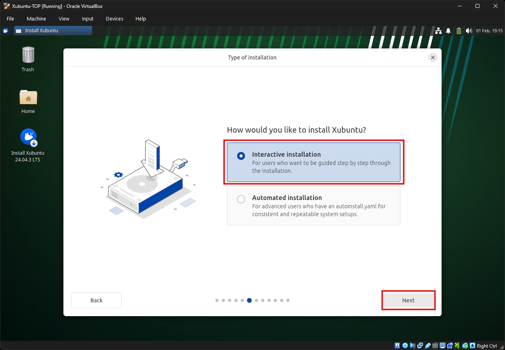

The next screen will ask you *What apps would you like to install to start with?*, of which once again we want the default option of all of them. If you're going to be using this VM as your studying tool then it should be fully featured. Click **Next** and move on.

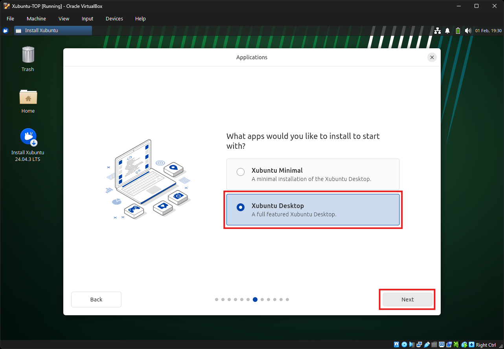

The next screen will ask you if you want to *Install recommended proprietary software?*, to which we answer: yes. Click both checkboxes and **Next** to move on.

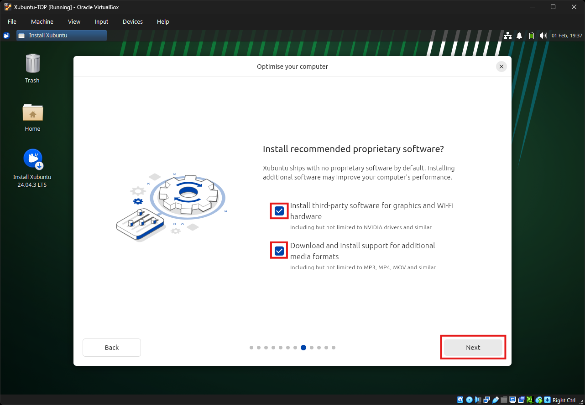

The next screen will ask you *How do you want to install Xubuntu?* In this case, we will once again select the default option to **Erase disk and install Xubuntu**. This action is safe and does not touch your host hard drive/disk because it is virtualized. As for Manual installation this is out of scope for the curriculum but if you'd like to dive deeper in the future it is recommended. Click **Next** when you're ready to move on.

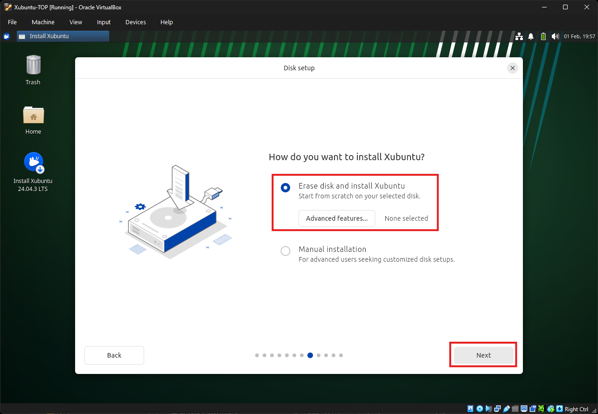

The next screen will have you *Create your account* by entering your name and a password. The computer name and username are auto generated by the name input, but you can customize these to your hearts content with valid characters. You should absolutely set a password, make it something you will be able to remember, one that you will be using often, and then please click **Next**.

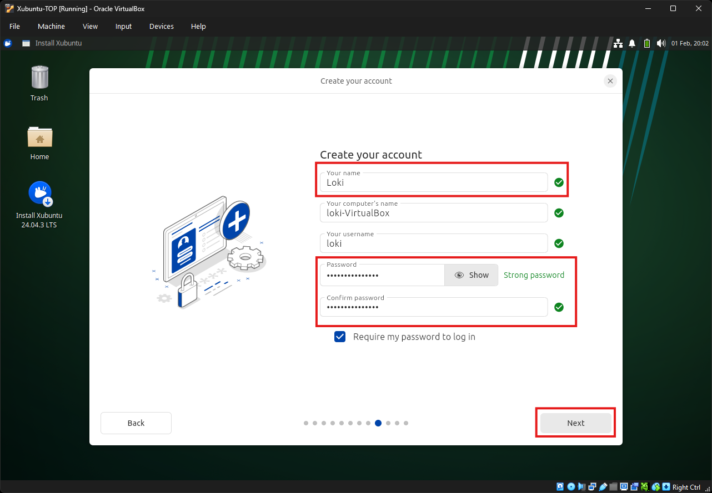

The next screen will ask you to *Select your timezone*. Insert either your location or timezone in the provided input boxes and click **Next**.

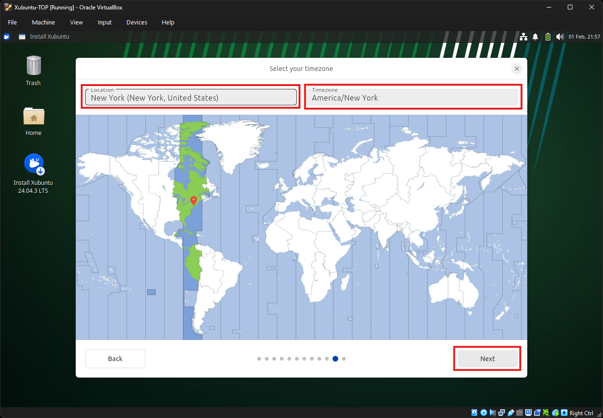

The next screen will ask you to *Review your choices* and finalize the installation. The information shown in the, while a bit confusing to understand right now, should reflect the decisions we have made along the way during this process. Once you're ready to wait for a while click the **Install** button and go grab some more coffee.

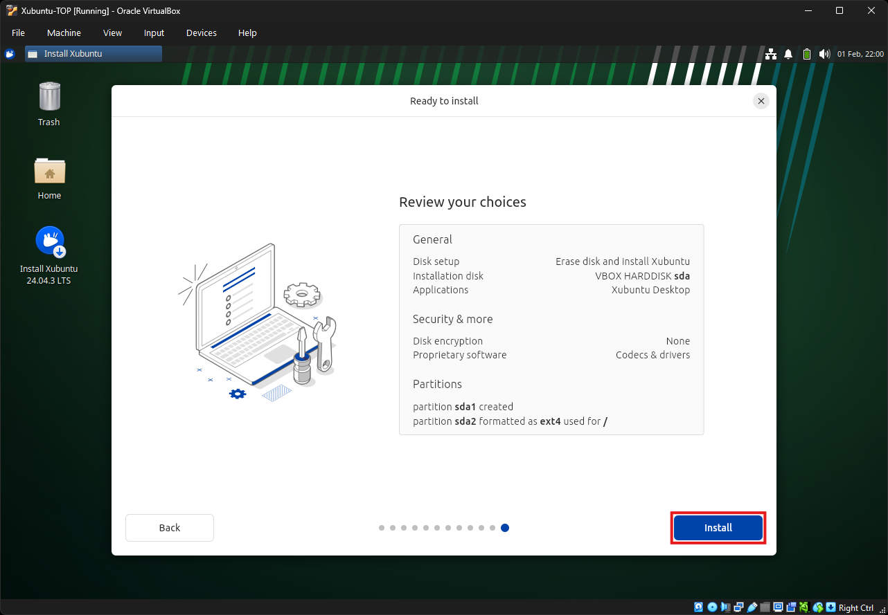

The next few screens will go by automatically during the installation process. There is not much you can do but wait.

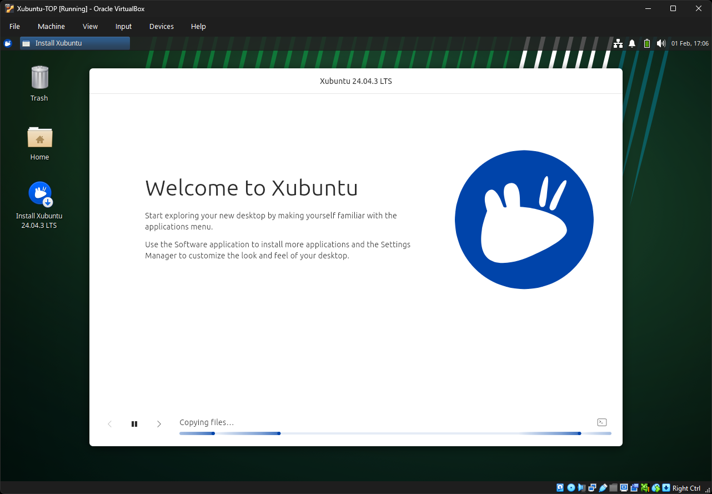

Once you have reached this screen that signals the installation has been successfully completed. You are now being prompted to exit your live desktop environment so you can boot your newly installed Xubuntu OS on your VM. Click **Restart now** to continue the process. If you end up clicking Continue testing and wish to continue, just click the , click Log Out, and then click Restart.

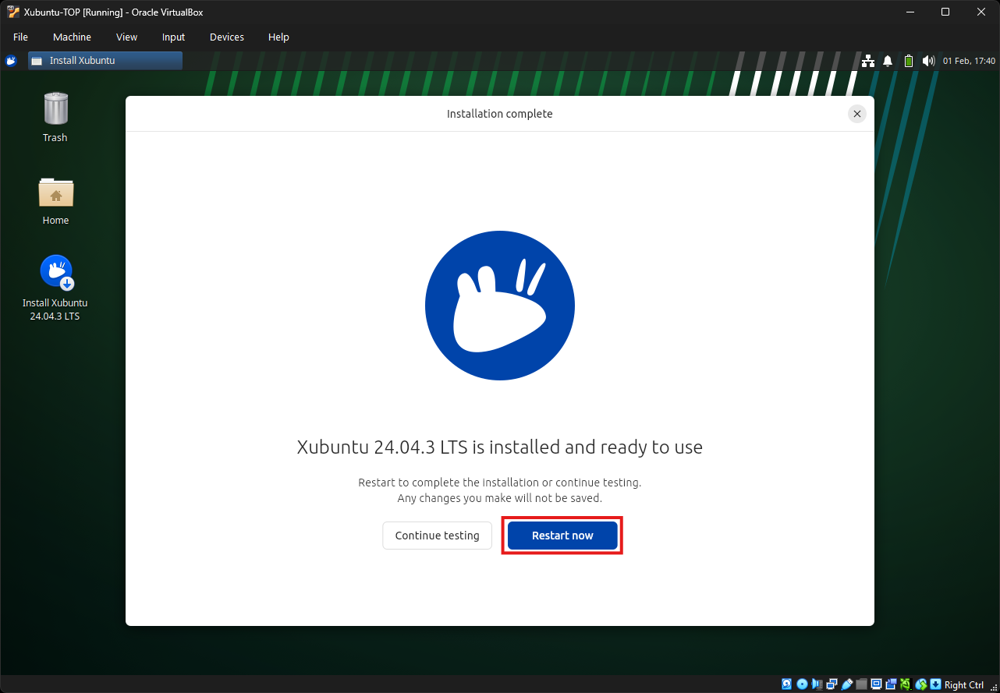

When your VM restarts you should end up on this screen here that is presenting you with a login screen. Enter your password and click **Log in**.

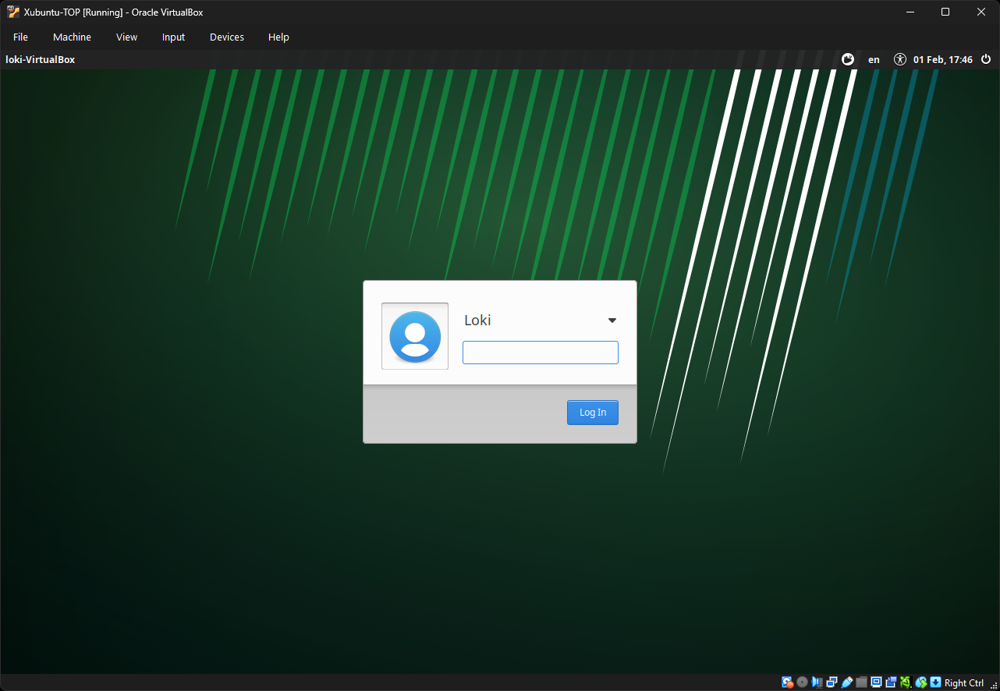

### Step 4: Updates and Guest Additions

Before you can start using your Virtual Machine you might have noticed that it is a little choppy, a little laggy, and maybe even a little small. The reason being is that we have not installed all of the necessary drivers for Xubuntu to take advantage of the VM's "hardware". This is what the **Guest Additions** accomplishes. VirtualBox provides an image for Guest Additions, so we will use it. But even before we do that, we should run updates.

We're going to learn a neat shortcut right now to open one of the most helpful tools available to you in a Linux based OS: The Virtual Terminal, or Terminal for short. The Terminal is actually virtual whether you're running in a VM or not, but that is out of scope for the curriculum. If you'd like to learn more about Linux in general check out the free book [The Linux Command Line](https://linuxcommand.org/tlcl.php).

When you press `Windows + T` a new window should open up that provides you with some information and prompts you for input. This is your terminal. You can have many terminals open at a time, but for now stick to one.

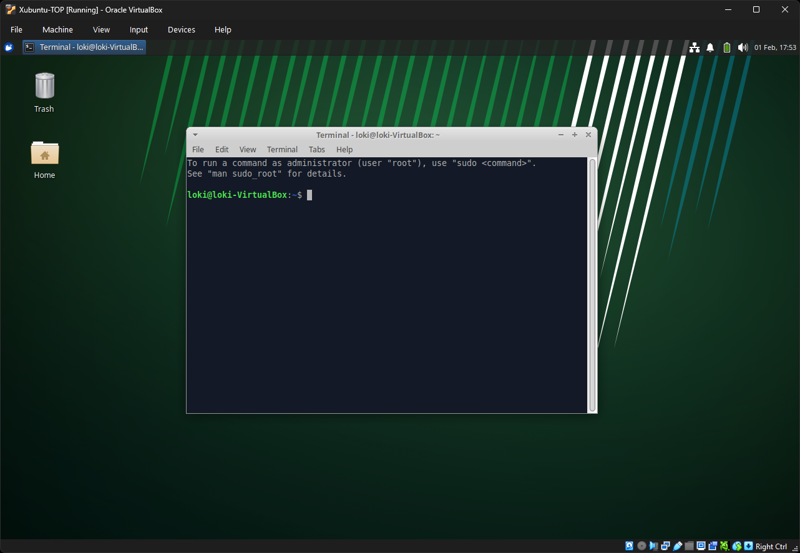

Now that we have the terminal open we can start running updates the *cool* way. There is a graphical user interface (GUI) process for running updates, but it looks really impressive when you run some commands in a command line interface (CLI) and a bunch of text runs across your screen with a progress bar and everything.

You're going to enter these commands exactly and hit enter after each new line. You cannot copy and paste yet.

```bash
sudo apt update
```

When you entered that first command you were prompted for your password. When you try to enter it there will be no feedback from the terminal, as if you are not writing anything at all. This is not a bug; It's a feature. A security feature. A lot of applications will represent your password as a number of dots. Linux goes the next step and does not give onlookers the opportunity to count dots on a screen.

Enter your password and hit enter, and you'll pull down the latest available updates.

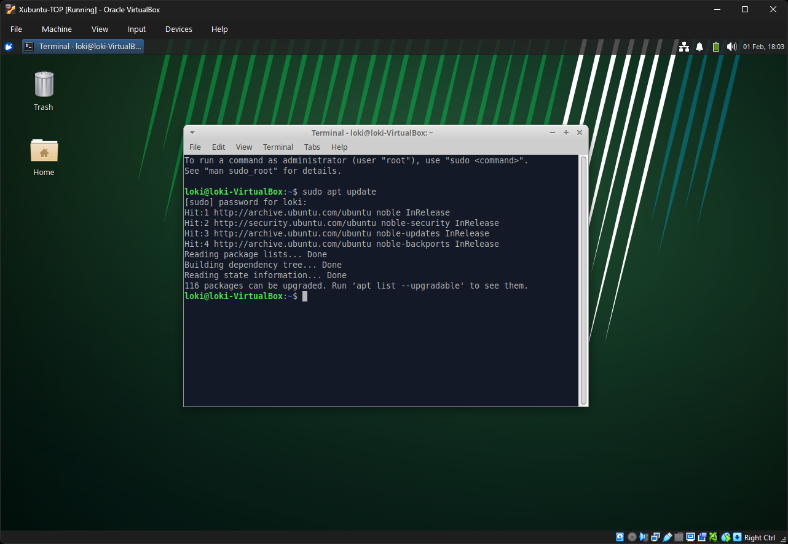

You will know when the process is done because the terminal will be available to take your input again. You'll get a print-out of how many packages can be upgraded.

Now that we have ran the update command, we still need to run the command to *upgrade* our packages. With Ubuntu flavored operating systems the process is two steps. Your mileage may vary in other systems.

The next command is this, type it in and hit enter:

```bash
sudo apt upgrade
```

That will show a whole lot more text and then ask you if you want to continue by typing either `Y` for Yes and `n` for No. Type `Y` and hit enter.

Also notice that if you did these two commands in sequence you were not prompted for your password again. There is a timer that starts when you run a `sudo` command successfully in that it will only wait for that timer to conclude before asking you again. More security features!

This may take a while.

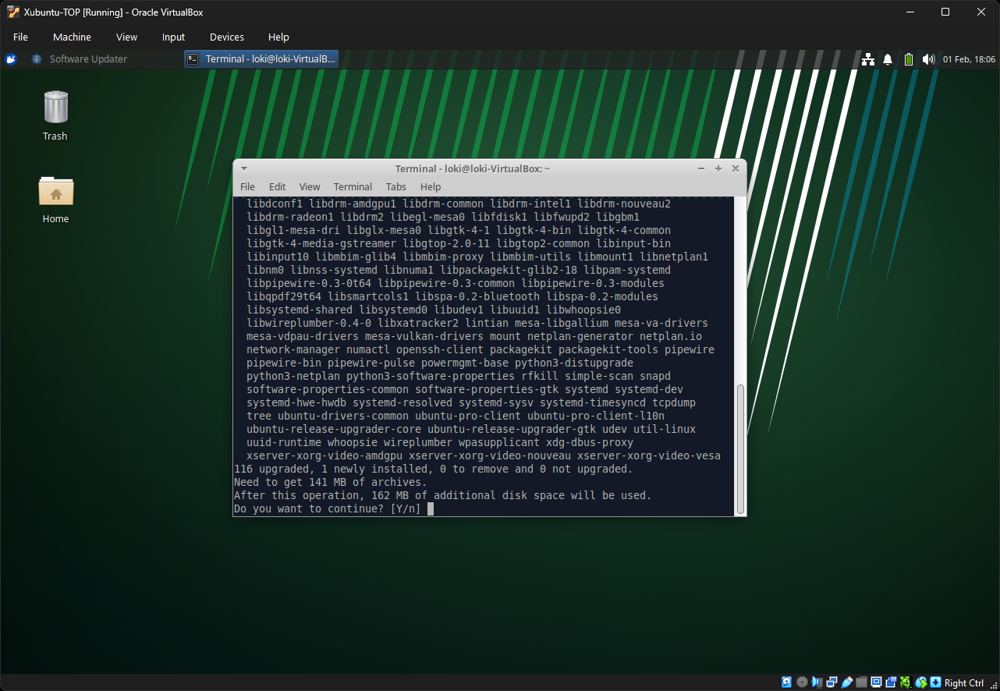

Once the upgrade has been completed let us install some helpful packages that will ensure our success with installing Guest Additions.

```bash
sudo apt install build-essential dkms
```

Be sure to enter `Y` to allow these packages to install. These are two separate packages being installed. Explaining them is out of scope but feel free to look them up on your own time.

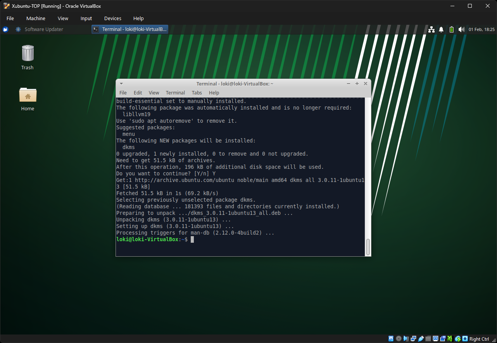

This next step is something that is difficult to take a screenshot of, so the highlight here will be the menu that you must click on to find it. On the top VM toolbar click **Devices** and navigate to the bottom of the dropdown where you see **Insert Guest Additions CD image...** and click on that. It might take a few seconds but a notification will appear that the CD has been mounted and a file window will open showing you the contents of the image.


The easiest way to install the Guest Additions from the contents of the image is to drag and drop the icon into the terminal. You are looking specifically for `VBoxLinuxAdditions.run`, and you want to click and hold and drag the icon onto your open terminal.

First let us clear our terminal output to make it cleaner by typing `clear` and pressing enter. Once it has been cleared type `sudo` with a space after it because we need it for administrative privileges. Then drag and drop the icon into the terminal.

Behold the mystical three-part instructional images.

Press enter and type your password if it is required to continue.

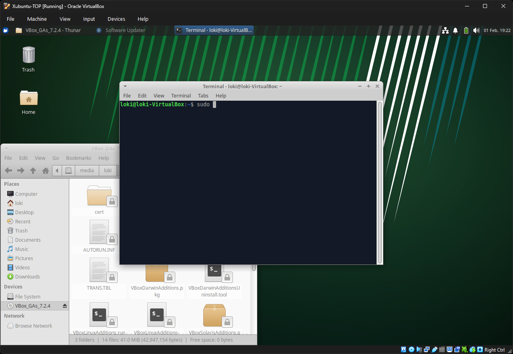

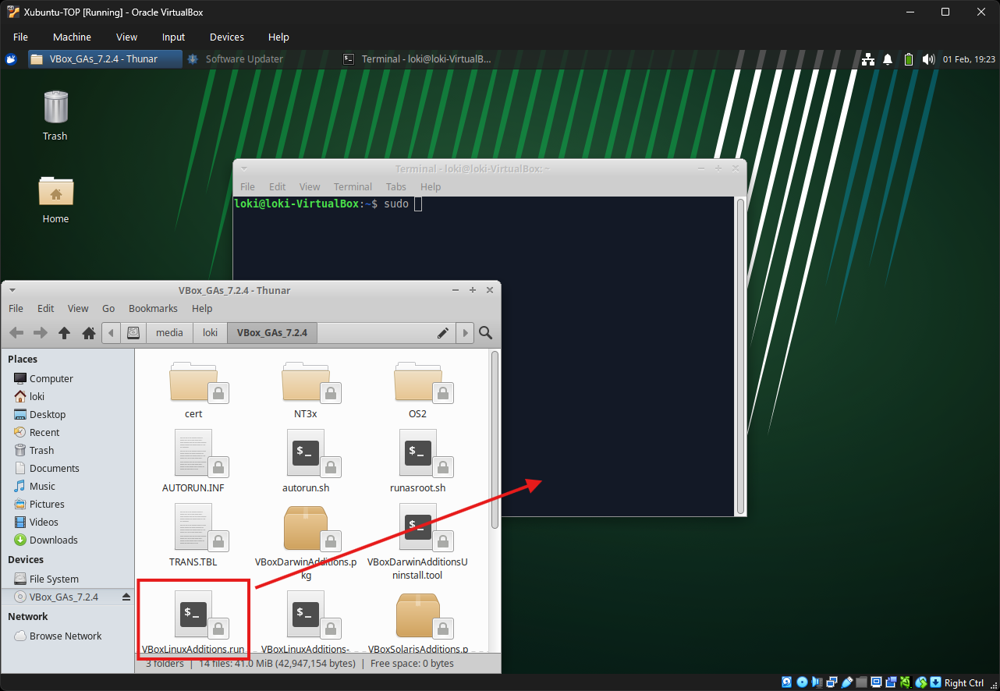

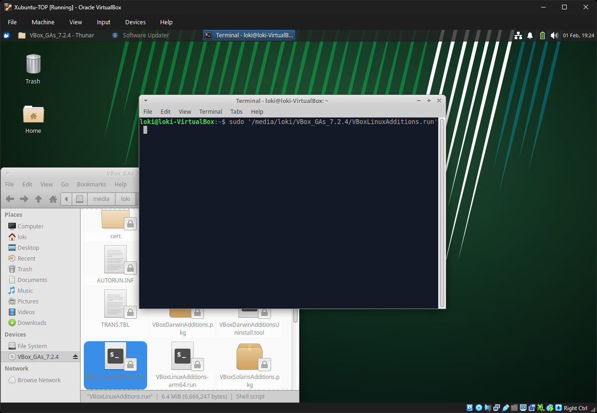

Your window may change size during this process. To complete the installation of the Guest Additions you need to reboot your VM. New shortcut unlocked: `sudo reboot`

Upon logging in you may not notice anything different, but try to maximize your VM now. Look at all of this room for activities!

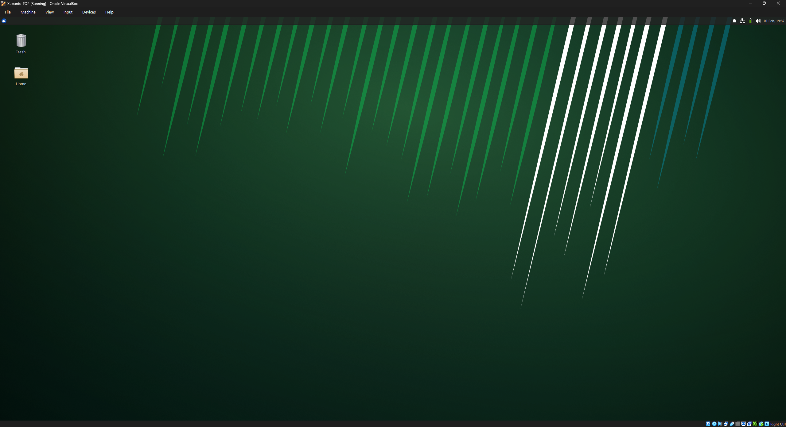

You should also have less performance issues overall and should now be ready to move on with the curriculum.

### Step 4: Understand your new VM

#### Step 4.1: Close TOP in the Windows browser and open the website in your VM

From now on, stick with The Odin Project (TOP) website within your VM and follow the Linux instructions provided. The curriculum will often require you to copy and paste code between the lesson and your coding space, as well as the terminal. This won't work smoothly if you switch between the VM and Windows because they are entirely separate environments.

**Remember:** For the remainder of the TOP curriculum, refer to the Linux instructions only.

Here are some tips to help you get started in a virtual environment:

- If the toolbar is not showing for you: Enable the toolbar in your VM settings - there are useful options there that you might want to play around with, especially the ones concerning full screen or multiple displays. To do so, click on **Settings** and then navigate to **User Interface** and finally tick **Show at Top of Screen**.
  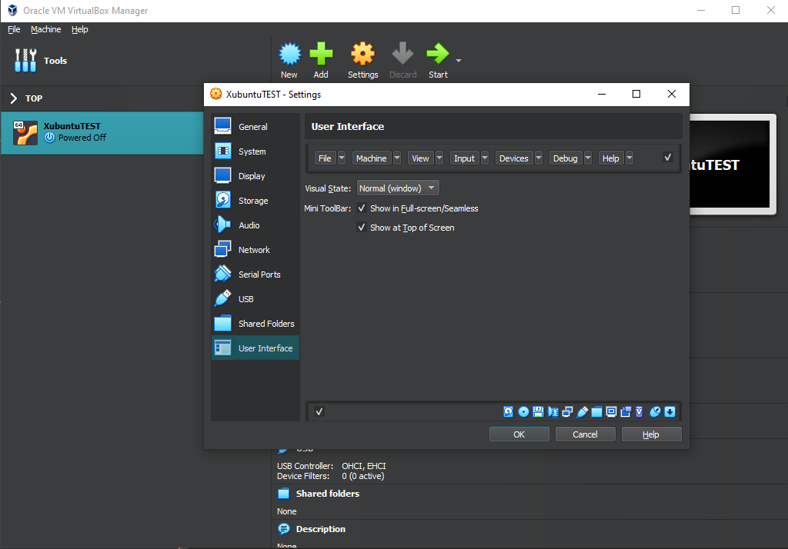
- All your work should happen in the VM. You will install everything you need for coding, including your text editor, language environments and various tools inside the VM. The Xubuntu installation inside of your VM also comes with a web browser pre-installed but we'll be installing Chrome shortly.
- Enable Shared Clipboard - On the aforementioned toolbar, under devices, you can enable Bidirectional under **Shared Clipboard**. Now you can copy and paste if you need to from your Host to Guest and Guest to Host. Please do remember you should be working fully within your VM if you can help it. Extra tip: `ctrl+shift+v` to paste in your terminal.
- To install software on your VM, you will follow the Linux (Ubuntu) installation instructions from inside the Xubuntu VM.
- You might need to take screenshots when asking for help on our Discord, here's how depending on where you use it:
  - **Inside the VM:** you can use <kbd>Shift</kbd> + <kbd>PrtSrc</kbd> to take screenshots of portion of your screen. Alternatively, you can click the **Whisker Menu** and type in **Screenshot**, in which you can choose to take a screenshot of your entire screen, the current window you are on or to select a certain area to capture.
  - **On your host (Windows):** you can use a shortcut of the Host Key (<kbd>Right Ctrl</kbd> + <kbd>E</kbd>) or click **View -> Take Screenshot** for a full screenshot. A different way would be unfocusing your VM window by clicking outside of it and then using the regular Windows shortcut of <kbd>Windows key</kbd> + <kbd>Shift</kbd> + <kbd>S</kbd> to take screenshots of portion of your screen.
- **Remember:** all of the development that you'll do related to TOP should be done in the VM.
- We recommend going full screen (**View -> Full-screen Mode**) and forgetting about your host OS (Windows). For best performance, close all programs inside of your host OS when running your VM.
- To add additional monitors, shut down the VM and go to the **Display** tab in the VirtualBox settings of the VM and increase the monitor count. Now, with the VM running, clicking **View -> Virtual Screen 2 -> Enable**. You can run fullscreen with multiple monitors, but it may ask for more **Video Memory**, which you should have increased when adding more monitors. **Make sure you enable your Virtual Screens in windowed mode before going fullscreen, otherwise they won't work.** Upon exiting fullscreen, your secondary display may close. You can reopen it with these instructions.

#### Frequent issues/questions

- If upon trying to start the VM you only get a black screen, close and `power off` the VM, click **Settings -> Display** in VirtualBox and make sure **Enable 3D Acceleration** is UNCHECKED, and Video memory is set to **AT LEAST 128MB**.
- Running out of space? Look at these [instructions for increasing VM disk space from the TOP Discord server](https://discord.com/channels/505093832157691914/690588860085960734/1015965403572351047).
- Are you using a touchscreen? [Watch a video on how to enable touchscreen controls for VirtualBox](https://www.youtube.com/watch?v=hW-iyHHoDy4).

- **VM performance tips**:
  - When running the VM, minimize your Windows activity. You probably want to be plugged into power as well if you're using a laptop.
  - Make sure your processors are set to only 2 and the Memory you've given your VM is at most half of your total RAM but at least 2GB. If you can't spare the 2GB, dual boot.
  - If videos lag in the VM, make sure to max out Video Memory to whatever you can or alternatively play them on your Windows if your machine can handle it. Disable 3D Acceleration if you have it enabled.
  - Do look out for the  icon in the bottom right of your VM window. This signifies that something called Hyper-V is turned on. A thread on the VirtualBox forums describes [how to turn off Hyper-V completely](https://forums.virtualbox.org/viewtopic.php?f=25&t=99390). You want to have the icon of a chip with a V  icon instead. If you don't see either of these icons in the bottom right, you have to exit full screen mode to see them. *Yes, the turtle is present in all of the helpful screenshots above.*
  - If your performance is still lacking, go for a dual boot as this will make sure you're using all of your specs for one OS only, thus improving your experience significantly.
- If your scroll wheel behaves oddly in Google Chrome and/or in other applications and you have gone through VM performance tips to make sure your VM is working as intended, look into [whether your version of Guest Additions is correct](https://discord.com/channels/505093832157691914/690588860085960734/1195697147123867668).

- **Safely shutting down your VM**

  - You don't pull the plug on your everyday use computer, right? Why would you do the same to your virtual computer? When you click the X button and just close out your VM, you might as well say goodbye to your files. In this section, you'll understand three ways you can shut off your VM.
    - Option 1 - Shutting down from inside the VM with UI

      Clicking on the **Whisker Menu**  and clicking the power icon will give you several options on how to modify your session, including **Shutting Down**. Yep, that's the same place you might've used to **Restart** before!

    - Option 2 - Shutting down from inside the VM with the terminal

      Typing `poweroff` inside the terminal will do in this case. Your system will immediately shutdown.

    - Option 3 - Shutting down from outside the VM

      The last way to accomplish this goal of safely shutting down is by using the VM interface. Clicking on the File tab and hitting the close button (which also has a Power Icon) will bring up a popup titled **Close Virtual Machine**. This popup asks if you want to **Save the machine state**, **Send the shutdown signal**, or **Power off the machine**.

      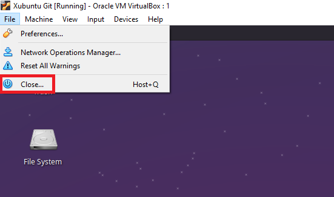

      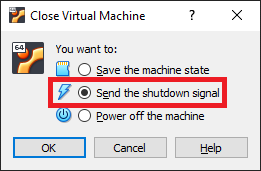

      To be safe, click the **Send the shutdown signal** radio and hit OK. This will safely power down your VM and your files will not get corrupted.

[Return to Installations lesson](https://www.theodinproject.com/lessons/foundations-installations#os-installation)
