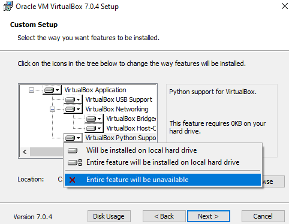
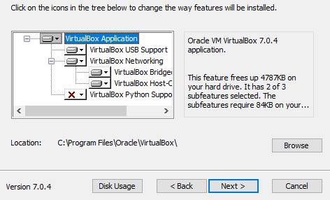
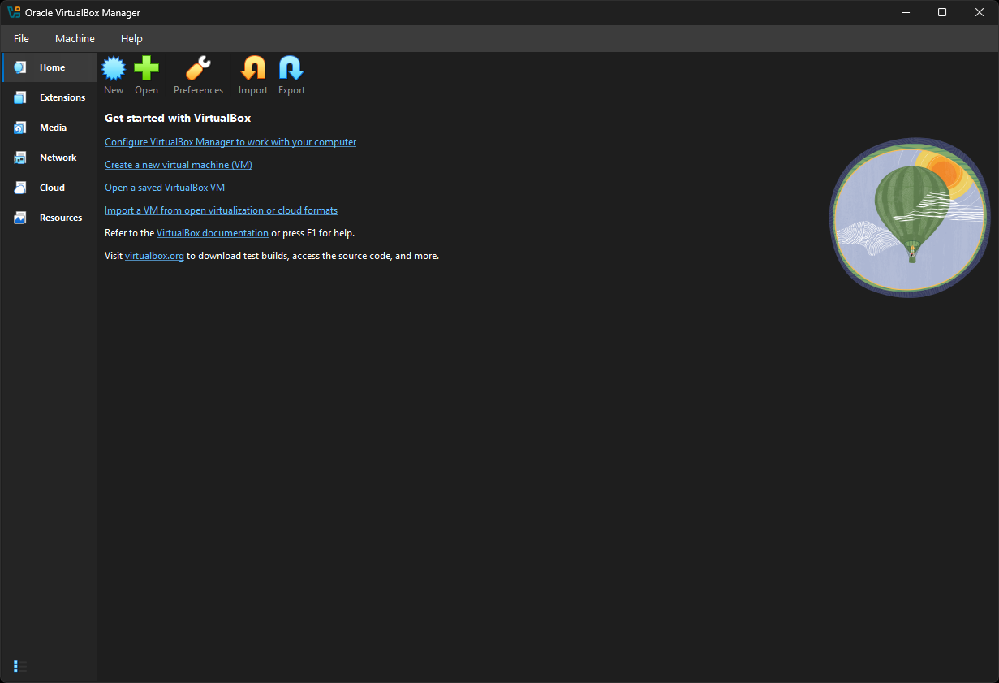
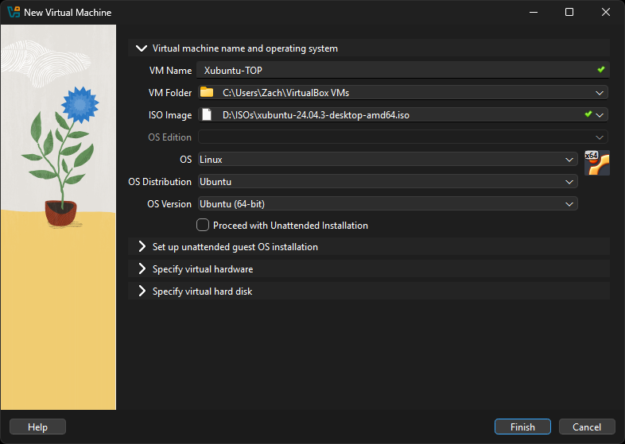
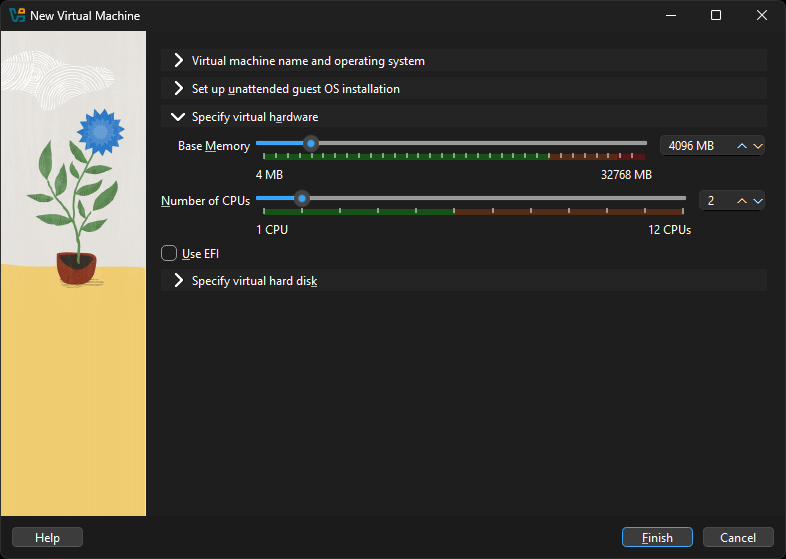
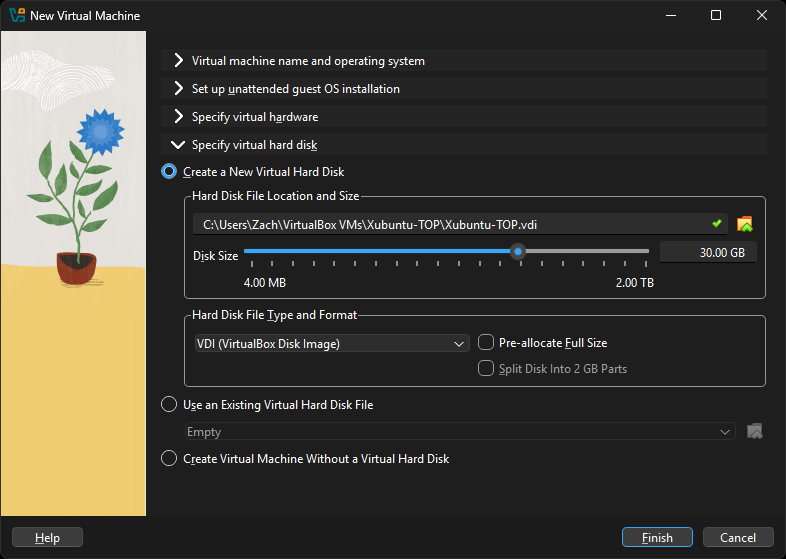

### Guide: Virtual Machine installation

Installing a Virtual Machine (VM) is the easiest and most reliable way to get started creating an environment for web development. A VM is an entire computer emulation that runs inside your current Operating System (OS), like Windows. The main drawback of a VM is that it can be slow because you're essentially running two computers at the same time. We'll do a few things to improve its performance.

### Step 1: Download VirtualBox and Xubuntu

Installing a VM is a straightforward process. This guide uses Oracle's VirtualBox program to create and run the VM. This program is open-source, free, and easy to use. What more can you ask for? Now, let's make sure we have everything downloaded and ready for installation.

#### Use only your VM for The Odin Project

Once you have completed these instructions, **you are expected to work entirely in the VM.** Maximize the window, add more virtual monitors if you have them, fire up the Internet Browser in the **Whisker Menu**  on the top left of the desktop. You should not be using anything outside of the VM while working on The Odin Project. If you feel like you have a good understanding after using the VM for a while, and or want to improve your experience, we recommend dual-booting Ubuntu, which there are instructions for below.

#### Step 1.1: Download VirtualBox

[Download VirtualBox for Windows hosts](https://www.virtualbox.org/wiki/Downloads).

#### Step 1.2: Download Xubuntu

There are thousands of distributions of Linux out there, but Xubuntu is undoubtedly one of the most popular and user friendly. When installing Linux on a VM, we recommend downloading [Xubuntu](https://xubuntu.org/release/24.04/). Click on the `Direct Downloads` button, find your nearest server location and click on it. There are a few files listed here, download the one ending in `.iso`, which will also be the largest one (around 4 gigabytes). Xubuntu uses the same base software as Ubuntu but has a desktop environment that requires fewer computer resources and is therefore ideal for virtual machines. If you find the download speed slow, you can download the [Xubuntu `.iso` directly from the official Ubuntu image server](https://cdimage.ubuntu.com/xubuntu/releases/noble/release/), as the previous link points to a US-based server.

If you reach the download page and are unsure about what version to choose, it is recommended that you pick the Long-Term Support (LTS) version 24.04 (Noble Numbat). You may be tempted to choose a more recent release, but this version is tried and tested by the Odin Project community and therefore the most reliable option for the purposes of this curriculum.

### Step 2: Install VirtualBox and set up Xubuntu

#### Step 2.1: Install VirtualBox

Installing VirtualBox is very straightforward. It doesn't require much technical knowledge and is the same process as installing any other program on your Windows computer. Double clicking the downloaded VirtualBox file will start the installation process.

#### Microsoft Visual C++ 2019

If you receive an error about needing Microsoft Visual C++ 2019 Redistributable Package, you can find it on the [official Microsoft Learn page](https://learn.microsoft.com/en-us/cpp/windows/latest-supported-vc-redist?view=msvc-170#visual-studio-2015-2017-2019-and-2022). You most likely want the version with `X64` Architecture (that means 64-bit) - download and install it then try installing VirtualBox again.

During the installation, you'll be presented with various options. We suggest dropping the Python Support as you don't need it by clicking on the drive icon with an arrow and choosing **Entire feature will be unavailable**:

This is how your installation window should look like after turning it off:

You do not have to exclude Python Support. It is an optional package to allow for automation Virtual Machines with VirtualBox, which is out of scope for this curriculum, and we simply do not want you to install more than what you have to.

Make sure you install the application on `C:` drive, as it has tendency to error out otherwise. The virtual machine itself can be installed anywhere but we'll get to that soon.
As the software installs, the progress bar might appear to be stuck; just wait for it to finish.

#### Step 2.2: New Virtual Machine

Now that you have VirtualBox installed, launch the program. Once open, you should see the start screen.

Click on the **New** button to create a virtual operating system. Give it a name of **Xubuntu-TOP**. If you want the VM installed somewhere else than default `C:` location, change that accordingly in the **Folder** option. This is the place where your virtual disk will reside, so make sure that you've got at least 30GB for that. In **ISO Image** choose **Other** - you'll see a window open for you to find the `.iso` file on your PC. It most likely is in the `Downloads` folder.

**Uncheck "Proceed with Unattended Installation".** This feature does not work and you will not be able to control your installation. If you do enable it accidentally before installing just delete your VM and try again.

The fields should auto populate once you enter the VM Name.

Do **not** click Finish yet! We're not done. Continue the setup process by pressing the **Specify virtual hardware** accordion and follow the next steps.

#### Step 2.3: Specify Virtual Hardware

You should see a window like this one now:

In the **Hardware** section of the installation you want to set your **Base Memory** to at least 2048 MB or more if possible - the upper limit is half of your total RAM but 4096 MB with the settings we recommend should give you a smooth experience.

> For example, if you have 8 GB (8192 MB respectively) of RAM, you could allocate up to 4096 MB (1024 MB to 1 GB) to your VM's operating system. You can Google how to find out how much RAM you have available if you do not know this already. If the VM runs a bit slow, try allocating more memory!

#### Converting gigabytes to megabytes

Difficulty converting your Gigabytes (GB) into Megabytes (MB)? 1 GB of RAM is equal to 1024 MB. Therefore, you can say that **8 GB = 8 x 1024 = 8192 MB.**

As for **Processors** you want this to be at 2 and no more. Leave **Use EFI** uncheck.

We're still not ready for the Finish button yet. Click the **Specify virtual hard disk accordion** to continue.

#### Step 2.4: Specify Virtual Hard Disk

Now, you want to leave all the settings as they are besides the **Disk Size**, we recommend giving the VM **at least 30GB** of space. Reminder that this disk will be created in the folder that you've specified on the very first step of the VM creation process but nonetheless, the disk can be moved and resized in the future if needed.

We are now ready to hit **Finish**. Please do so.

### Step 3: Begin Xubuntu installation
