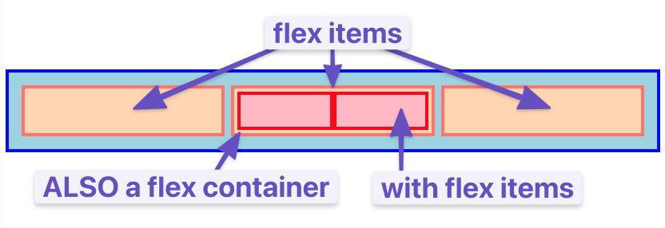

### Introduction
As you'll learn, there are _many_ ways to move elements around on a webpage. Over the years new methods have been developed, and older things have fallen out of style. Flexbox is a [relatively new](https://medium.com/@BennyOgidan/history-of-css-grid-and-css-flexbox-658ae6cfe6d2) way of manipulating elements in CSS, and when it was introduced it was _revolutionary_.

Because it is somewhat new as a technology, many resources put it near the end of their curriculum, but at this point, it has become the default way of positioning elements for many developers. Flexbox will be one of the most used tools in your toolbox, so why not learn it first?

### Learning Outcomes

In the following lessons: 

* You will learn how to position elements using flexbox.
* You will learn about flex-containers and flex-items.
* You will learn how to create useful components and layouts that go beyond just stacking and centering items.

### Let's Flex!

Flexbox is a way to arrange items into rows or columns where those items will flex (i.e. grow or shrink) based on some simple rules that you can define. To get started, let's look at a simple demonstration. For all of the exercises here, take your time to inspect the code and really understand what's going on. Actually playing with the code yourself will make it much easier to retain this information.

  See the Pen <a href="https://codepen.io/TheOdinProjectExamples/pen/QWgNxrp">
  first flex example</a> by TheOdinProject (<a href="https://codepen.io/TheOdinProjectExamples">@TheOdinProjectExamples</a>)
  on <a href="https://codepen.io">CodePen</a>.

We'll get into exactly what's going on here soon enough, but for now, uncomment the two flex related lines in the above css and check out the result. All 3 divs should now be arranged horizontally. If you resize your browser you'll also see that the divs will 'flex'. They will fill the available area, and will each have equal width.

If you go and add another div to the HTML, inside of `.flex-container`, it will show up alongside the others, and everything will flex to make it fit.

> #### Note:
> If it's hard to see what's going on in the small embedded CodePen, feel free to click the button that will bring the example into a full CodePen environment. Later examples especially might benefit from doing this.

#### Flex Containers and Flex Items
As you've seen, flexbox isn't just a single css property, but a whole toolbox of properties that you can use to put things where you need them. Some of these properties belong on the _flex container_ and some go on the _flex items_. This is a simple but important concept.

A flex container is any element that has `display: flex` on it. A flex item is any element that lives directly inside of a flex container.

Somewhat confusingly, any element can be both a flex container _and_ a flex item. Said another way, you can also put `display: flex` on a flex item, and then use flexbox to arrange _its_ children.

This method of creating and nesting multiple flex containers and items is the primary way we will be building up complex layouts. The next image was achieved using _only_ flexbox to arrange, size, and place the various elements. It is a _very_ powerful tool.

### Knowledge Check
* What's the difference between a flex container and a flex item?
* How do you create a flex item?
