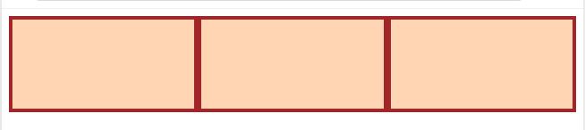
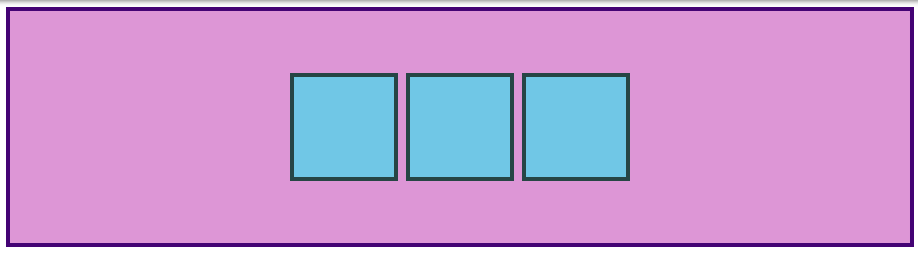

### Introduction
As you'll learn, there are _many_ ways to move elements around on a webpage. Over the years new methods have been developed, and older things have fallen out of style. Flexbox is a (relatively new)[https://medium.com/@BennyOgidan/history-of-css-grid-and-css-flexbox-658ae6cfe6d2] way of manipulating elements in CSS, and when it was introduced it was _revolutionary_.

Because it is somewhat new as a technology, many resources put it near the end of their curriculum, but at this point it has become the default way of positioning elements for many developers. Flexbox will definitely be one of the most used tools in your toolbox, so why not learn it first?

### Learning Outcomes
* You will learn how to position elements using flexbox.
* You will learn about flex-containers and flex-children.
* You will learn how to create useful components and layouts that go beyond just stacking and centering items.

### Let's Flex!

Flexbox is a way to arrange items into rows or columns where those items will flex (i.e. grow or shrink) based on some simple rules that you can define. To get started, lets look at a simple demonstration.  Copy this HTML and CSS into a file (a repl.it project or codepen is also fine) and view it in a browser.

~~~html

  

  

  

~~~

~~~css
.flex-container {
  /* display: flex; */
}

/* this selector selects all divs inside of .flex-container */
.flex-container div {
  background: peachpuff;
  border: 4px solid brown;
  height: 100px;
  /* flex: 1; */
}
~~~

The result should look something like this:

We'll get into exactly what's going on here soon enough, but for now uncomment the two flex lines in your css and check out the result. Your 3 divs should now be arranged horizontally. If you resize your browser you'll also see that the divs will 'flex'. They will fill the available area, and will each have an equal width. 

If you go and add another div to your html, inside of `.flex-container`, it will show up alongside the others, and everything will flex to make it fit.

#### Flex Containers and Flex Items
As you've seen, flexbox isn't just a single css property, but a whole toolbox of properties that you can use to put things where you need them. Some of these properties belong on the _flex container_ and some go on the _flex items_. This is a simple but important concept.

A flex container is any element that has `display: flex` on it. A flex item, is any element that lives directly inside of a flex container.

Somewhat confusingly, any element can be both a flex container _and_ a flex item. Said another way, you can also put `display: flex` on a flex item, and then use flexbox to arrange _its_ children. 

This method of creating and nesting multiple flex containers and items is the primary way we will be building up complex layouts. The next image was achieved using _only_ flexbox to arrange, size and place the various elements. It is a _very_ powerful tool.

The resources to follow will take you through the basics. Be sure to follow along with any examples, that will help things to stick a little better when it comes time to practice your newfound skills.

#### Axes
The most confusing thing about flexbox is that it can work either horizontally or vertically, and the way some rules work changes a bit depending on which direction you are working with.

The default direction for a flex container is horizontal, or `row` but you can change the direction to vertical or `column`. The direction can be specified in CSS like so:

~~~css
.flex-container {
  flex-direction: column;
}
~~~

No matter which direction you're using, you need to think of your flex-containers as having 2 axes, the main axis and the cross axis. In a `row` container, the main axis runs horizontally across the page in the same direction as `inline` elements which is _usually_ across the page from left to right and the cross axis runs from top to bottom horizontally. In a `column` container, the main axis runs vertically in the same direction as your `block` elements, from top to bottom, and the cross axis is horizontal.

That definition was stated in overly technical terms because there is some important subtlety here. Stated more clearly: in _most_ circumstances, `row` puts the main axis horizontal, left-to-right, and `column` puts the main axis vertical, top-to-bottom. There are situations where that could change if you are using a language that is written top-to-bottom or right-to-left, but you should save worrying about that until you are ready to start making a website in Arabic or Hebrew.

#### Aligning Across the Axes
So far everything we've touched with flexbox has used the rule `flex: 1` on all flex items, which makes the items grow or shrink equally to fill all of the available space. Very often however, this is not the desired effect. Flex is also very useful for arranging items that have a specific size. Lets look at another example. Put the following code somewhere and follow along.

~~~html

  

  

  

~~~

~~~css
.container {
  padding: 16px;
  background: plum;
  border: 4px solid indigo;
  display: flex;
}

.item {
  width: 100px;
  height: 100px;
  border: 4px solid darkslategray;
  background: skyblue;
}
~~~

The result of the above code should look like this.

You should be able to predict what happens if you stick `flex: 1` on the `.item` by now. Give it a shot before we move on!

Adding `flex: 1` to `.item` will make each of the items grow to fill the available space, but what if we wanted them to stay the same width, but distribute themselves differently inside the container? We can do this!

Remove `flex: 1` from `.item` and add `justify-content: space-between` to `.container`. Doing so should give you this:

`justify-content` aligns items across the **main axis**. There are a few values that you can use here. You'll learn the rest of them in the reading assignments, but for now try changing it to `center`, which should center the boxes along the main-axis.

To change the placement of items along the **cross axis** use `align-items`. Try getting the boxes to the center of the container by adding `align-items: center` to `.container`. The desired result should look like this:

#### GAP
One more very useful feature of flex is the `gap` property. Setting `gap` on a flex container simply adds the specified space between flex items, very similar to adding a margin to the items themselves. `gap` is a _very_ new property so it doesn't show up in very many resources yet, but it works reliably in all modern browsers, so it is safe to use and is very handy! Adding `gap: 8px` to the centered example above produces this result.

There's more for you to learn in the reading below, but at this point surely you can see how immensely useful flexbox is. Using just the properties we've already covered you could already put together some impressive layouts!

Take your time going through the reading. There will be some review of the items we've already covered here, but it goes into more depth and touches a few things that haven't been mentioned yet. Don't stress too much about trying to memorize every little detail yet, just code along with the examples and do your best to internalize everything that is _possible_ with flexbox. You'll have to reach for these resources again once you get to the practice exercises, but that's perfectly acceptable. The more you use this stuff the better it will stick in your mind... and you will be using it _constantly_. Have fun!

### Assignment

1. The [Basic concepts of flexbox](https://developer.mozilla.org/en-US/docs/Web/CSS/CSS_Flexible_Box_Layout/Basic_Concepts_of_Flexbox) article on MDN is a good starting point. There are helpful examples and interactive sections.
2. [Aligning Items in a Flex Container](https://developer.mozilla.org/en-US/docs/Web/CSS/CSS_Flexible_Box_Layout/Aligning_Items_in_a_Flex_Container) goes into more depth on the topic of axes and `align-items` vs `justify-content`.
3. [Typical use cases of Flexbox](https://developer.mozilla.org/en-US/docs/Web/CSS/CSS_Flexible_Box_Layout/Typical_Use_Cases_of_Flexbox) is one more MDN article that covers some more practical tips. Don't skip the interactive sections! Playing around with this stuff is how you learn it!
4. The [CSS Tricks "Guide to Flexbox"](https://css-tricks.com/snippets/css/a-guide-to-flexbox/) is a classic. There isn't any new information for you here, but the images and examples are super helpful. This one is a great resource when you need a reminder on how to do something. (i.e. what's the difference between 'align-items' and 'justify-content')

### Practice
add exercises here... will be writing those shortly.

### Additional Resources
This section contains helpful links to other content. It isn't required, so consider it supplemental for if you need to dive deeper into something
* [What the Flexbox!?](https://flexbox.io/) is a great free video course from Wes Bos. If videos are your thing, this is a great resource for you. It's a good refresher if you're having a hard time getting this stuff to stick.
* [Flexbox froggy](https://flexboxfroggy.com/) is a funny little game for practicing moving things around with flexbox.
* This [Flexbox Tutorial](https://www.freecodecamp.org/news/css-flexbox-tutorial-with-cheatsheet/) from freecodecamp is another decent resource.

### Knowledge Check
*