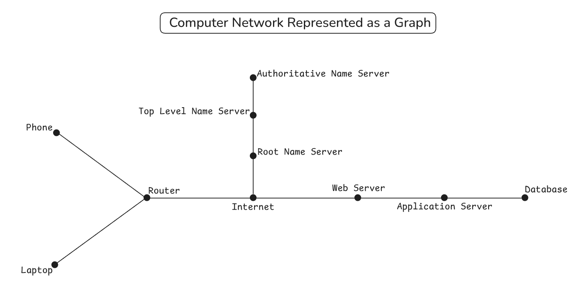

### Introduction

A graph is a way to represent connections between things. Think of it like drawing points (called vertices or nodes) and connecting them with lines (called edges). Graphs have a wide variety of applications, and we can use them to model complex relationships. For example:

- In a social network, each person is a vertex, and friendships are edges.
- In a road map, cities are vertices, and roads between them are edges.
- In a computer network, devices are vertices, and connections between computers are edges.



### Why use graphs?

Graphs are incredibly useful for modeling relationships and connections. They help us solve real-world problems like:

1. Finding the shortest route between two cities.
1. Suggesting friends on social media.
1. Planning computer network layouts for reliability and speed.
1. Analysing and managing dependencies when bundling code.
1. Ranking pages based on connections to similar pages by search engines.

There are a handful of types of graphs used to solve this wide variety of problems. For a more thorough introduction on what graphs are, read [Khan Academy's "Describing Graphs" lesson](https://www.khanacademy.org/computing/computer-science/algorithms/graph-representation/a/describing-graphs). The following types of graphs will be of particular importance for this project:

- **Simple vs. Non-simple**: A simple graph is one that has no self-loops (an edge connecting a vertex to itself) and no multi-edges (multiple edges connecting the same pair of vertices). A non-simple graph is permitted to have these properties.
- **Directed vs. Undirected** : In a directed graph, edges have a direction that can go only one way (if A connects to B, B doesn't necessarily connect to A). In an undirected graph, edges go both ways (if A connects to B, B connects to A).
- **Weighted vs. Unweighted**: In a weighted graph, edges have a numeric weight that specifies something about them. In an unweighted graph, edges do not encode this information — no one connection is more important than any other.

The computer network graph at the beginning of this project is an example of a simple, undirected, unweighted graph. This is the type of graph we will be building in this project.

### Representing a graph

In our code, there are several ways we could represent a graph. Two of the most common representations include *adjacency lists* and *adjacency matrices*. Read [w3schools' Graphs article](https://www.w3schools.com/dsa/dsa_theory_graphs.php) to familiarise yourself with these ideas.

In this project, we'll be using an adjacency list to represent the graph. We've picked this style of graph because they are usually a bit easier to work with, they use less space for many real-world graphs, and they are often a better fit for modeling the kinds of relationships you'll encounter in practice. If you would like, you can read [GeeksforGeeks Comparison between Adjacency List and Adjacency Matrix article](https://www.geeksforgeeks.org/dsa/comparison-between-adjacency-list-and-adjacency-matrix-representation-of-graph/) for an explanation of the time and space complexity trade-offs between the two representations.

### Assignment

<div class="lesson-content__panel" markdown="1">

You'll build a simple, undirected, unweighted graph implementation using an adjacency list. The focus is on understanding how to store and manipulate graph relationships. For simplicity, you may assume that the values of each vertex are unique in the graph.

Build a `Graph` class (or factory) to represent your graph. For now, it should only include storage for an `adjacencyList`. Then proceed to create the following methods:

1. `addVertex(value)`: Adds `value` to the adjacency list. Does nothing if `value` is already in the graph.

   <div class="lesson-note lesson-note--tip" markdown="1">

   #### An important graph invariant

   The number of entries in the adjacency list should always be the same as the number of vertices in the graph.

   </div>

1. `addEdge(value1, value2)`: Creates an edge between the two vertices `value1` and `value2`. If either `value1` or `value2` are not in the graph, creates a vertex for them before creating the edge. Remember that our graph is *simple*, *undirected*, and *unweighted*, so you must take this into consideration.
1. `toString()`: Returns a string that represents the underlying adjacency list. You can use this to print the graph and inspect its state. The string representation should look something like this:

   ```text
   X -> ( Y, Z )
   Y -> ( X )
   Z -> ( X )
   ```

1. `hasVertex(value)`: Returns `true` if the graph contains the vertex `value`. Returns `false` if the graph does not contain `value`.
1. `areAdjacent(value1, value2)`: Returns `true` if the vertices `value1` and `value2` are adjacent. Returns `false` if they are not adjacent. Recall that two vertices are adjacent if they are connected by an edge.
1. `removeVertex(value)`: Removes the vertex `value` from the adjacency list. Any edges that were connected to this vertex should be removed as well. Does nothing if `value` is not in the graph.
1. `removeEdge(value1, value2)`: Removes an edge between the vertices `value1` and `value2`. Does nothing if either `value1` or `value2` are not in the graph.
1. `getOrder()`: Returns a number that represents the order of the graph. This is the number of vertices in the graph.
1. `getSize()`: Returns a number that represents the size of the graph. This is the number of edges in the graph.
1. `getDegree(value)`: Returns a number that represents the degree of the vertex `value`. If `value` is not in the graph, return `undefined`. The degree of a vertex is the number of edges that are connected to that vertex.
1. `getNeighbors(value)`: Returns an array of all the vertices that are adjacent to the vertex `value`. If `value` is not in the graph, return `undefined`.
1. `getCommonNeighbors(value1, value2)`: Returns an array of all the vertices that are adjacent to both of the vertices `value1` and `value2`. If either `value1` or `value2` are not in the graph, return `undefined`.

#### Test Your Graph

1. Create a new JavaScript file. Import your `Graph` class or factory.
1. Create a new instance of your graph.

   ```javascript
   const graph = new Graph() // or Graph() if using a factory
   ```

1. Populate your graph using the `addVertex(value)` and `addEdge(value1, value2)` methods by copying the following:

   ```javascript
   // Add some vertices
   graph.addVertex("A")
   graph.addVertex("B")
   graph.addVertex("C")
   graph.addVertex("D")

   // Add some edges
   graph.addEdge("A", "B")
   graph.addEdge("B", "C")
   graph.addEdge("A", "C")
   graph.addEdge("C", "D")
   ```

   <div class="lesson-note" markdown="1">

   #### A vertex can be anything

   We're using letters as the vertices here, but they could be anything we wanted. We could be using strings, numbers, or even a custom `Vertex` class or factory.

   </div>

1. Now you have your graph populated, try out a few of the methods by copying the following:

   ```javascript
   console.log(graph.toString())
   // The list should now look like this:
   // A -> ( B, C )
   // B -> ( A, C )
   // C -> ( A, B, D )
   // D -> ( C )

   console.log(graph.getOrder()) // Should log 4
   console.log(graph.getSize()) // Should log 4

   graph.removeEdge('C', 'B')
   console.log(graph.getSize()) // Should log 3

   console.log(graph.getNeighbors('A')) // Should log ['B', 'C']
   console.log(graph.getCommonNeighbors('A', 'D')) // Should log ['C']
   console.log(graph.getCommonNeighbors('A', 'B')) // Should log []
   ```

1. Lastly, experiment with different combinations of all the methods you have in your graph! Make sure everything is working as you expect it to.

</div>
