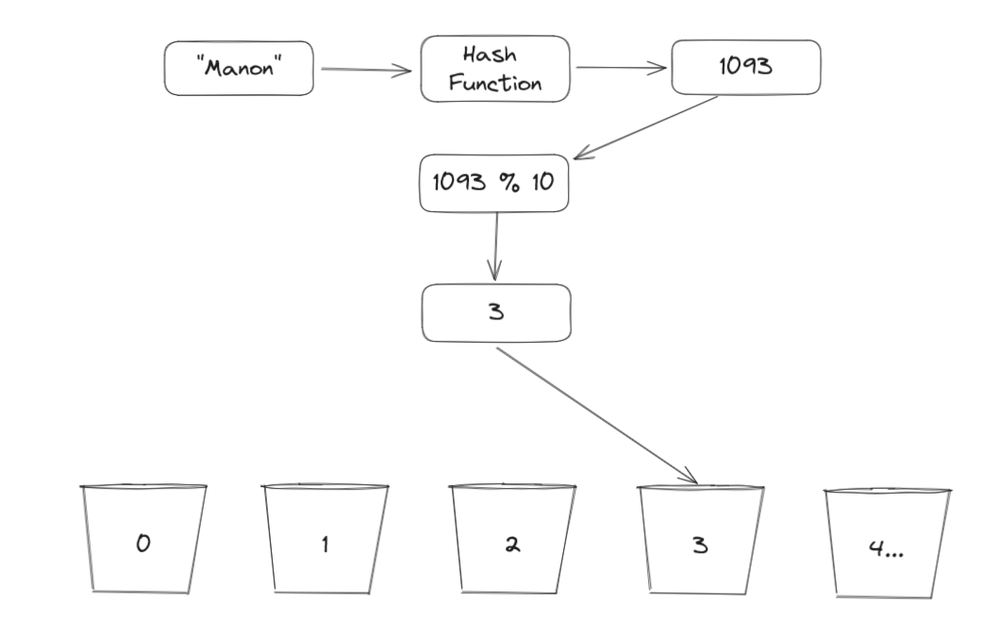

### Introduction
One of the most used data structure across all languages is a Hash Table, aka Hash Map. If you worked before with JavaScript Objects (Which you should have), Set, and Map then you are already familiar with a hash table, but how do they work exactly under the hood, how can we save values using strings and symbols as keys and then retrieving those values.

In this project you will learn how it all works and you will implement your own Hash Map class! To start we need to learn few concepts one of which is a hash code, what does it mean, and how to use it. Let us get started and hope you are exited to finally know what is happening with an object when you put keys and values in them.

### What is a hash code

Let's tart by learning what does it mean to hash a value. Hashing means taking an input in and generating an output that represents this input. Hashing the same input should give us the same hash code, there should be no random generation that is happening. For example, let's work a hashing function that takes a name and gives us the first letter of that name:

```javascript
function hash(name) {
  return name.charAt(0);
}
```

We created our first basic hashing function, it takes a name and returns the first letter of that name.
You might be familiar with this concept from your cipher exercise earlier in foundation, but there is a key difference between hashing and ciphering (encryption), which is reversibility.

Hashing is a one-way process. Here is an example given a name, you can get a hash out of it, but given a hash, you cannot revert it back to a name. If you have a name "Carlos" we can hash it to "C" but to reverse it from "C" you cannot know if it is "Carlos", maybe it's "Carla" or "Carrot" we don't know. This is very good for security also, given a password you can save the hash of that password, but if someone steals your hashes they cannot know the original passwords unable to reverse the hash back to the password. We are not going to dive deeper into hashing passwords here as there are other techniques and this is a subject for another lesson.

### Use cases

What can we do with those hashes, You have probably seen it in school where a folder is organized into smaller folders, each folder holds information about people with the same first letter, so we get something like this:

```
C:
  carlos.txt
  carla.txt
B:
  bryan.txt
  bob.txt
  beatrice.txt
  bella.txt
  benjamin.txt
  bianca.txt
```

If we get new student in our school system, with the name of `Carl` we can run our hash function to find out what folder do we assign for them `hash("Carl") -> C` so we put "Carl" in the directory `C`

You might have spotted a problem, what if our school is populated with many people that share the same first letter "C"? Then we will have a directory with "C" that have too many names that start with "C" and other directories that are almost empty. We need to rework our hash function, to eliminate more duplication and separate our students, while keeping constant structure in folders.

```javascript
function hash(name, surname) {
  return name.charAt(0) + surname.charAt(0);
}
```

Instead of just taking the first name letter, we take the first name and last name letters. "Carlos Smith" will have a hash code of "CS" this will surely narrow down our directories, and it's much better now, it will eliminate many duplicate hash codes from our directories.


But it still doesn't solve our problem, what if we have a very popular first name's first letter and surname's first letter? Then we are again with directories that are empty and other directories that are full, we need it easier for us to find the person we are looking for, so let's rework our hash code.

```javascript
function stringToNumber(string) {
  let hashNumber = 0;
  for (let i = 0; i < string.length; i++) {
    hashNumber += string.charCodeAt(i);
  }

  return hashNumber;
}

function hash(name, surname) {
  return stringToNumber(name) + stringToNumber(surname);
}
```

You might be thinking, wouldn't it be just better to save the whole name as a hash code? That is true, this would make it unique for each name, but there is a better one that is globally used, which is using a number. There are benefits by using a number as a hash code instead, let's explore them:

- Firstly we do not save the hash code, the hash code is a calculation to simply find out which bucket (storage) our value will have to go to. Think about it as a locker number for example.

- We save computation time. If we are to find where our hash is stored it would be much faster and easier for a computer to compare two numbers rather than a string (or objects) to find the bucket where we have to store our elements (you will learn more about buckets shortly). Finding a bucket using a number would allow us to use that number as our index, which means finding a bucket complexity would be `O(1)`

- By using number as hash code, we can have a hash codes that is uniform across variables where it doesn't have to only be a string, we can even hash numbers, or objects we simply need an algorithm to generate a hash code number for our needs from an object, taking `class Person` object as an example, our hash code can be a combination of the `strinngToNummber(name) + age`.

### Collisions

We have another problem that we need to track down, Collisions. A collision means two different values generating the exact same hash code.

Let's take an example: hashing the name "Carlos" and the name "Clarso" will generate the same hash code. That is because the letters in both names are the same, just arranged differently. There is no way to eliminate collisions entirely, but we try to minimize them as much as possible, turn out we can rework our `stringToNumber` function so that it can give us unique hash codes which depends on where the letter appear in the name using an algorithm we can work on this.

```javascript
function stringToNumber(string) {
  let hashNumber = 0;
  for (let i = 0; i < string.length; i++) {
    hashNumber += string.charcodeAt(i) * i;
  }
  return hashNumber;
}
```

With our new function we will have different hash codes for the names "Carlos" and "Clarso" that is because even so both names have the same letters, some of the letters appear in different places. We take advantage of that by multiplying the letter code by the index of where that letter appeared.

You do not need to write your own hash functions, but understanding how they work is important. Writing a hash function is art and there are many ways to generate hashes with techniques that languages adopted over the years. Such as using prime numbers to multiply the index with etc..

Check out [This Video](https://www.youtube.com/watch?v=btT4bCOvqjs) from CS50 that explains the concept shortly with visualization

### Buckets

Buckets are storage that we need to store our elements, simply it's an array from now on we will be referring to our storage as buckets. You have buckets each is assigned a hash, since our hash function now produce a number we're going to assign each bucket a number. We receive a key "Fred" We hash it using our hash function it produce the number `508` we look which Bucket is labeled `508` we put "Fred" in the bucket. This is the simple form, but there are more mechanics that we need to deal with.

To get a value using a key, we simply have each entry inside a bucket as a Node item, which hold both the key and the value. To retrieve the value we simply hash a key, we find the bucket number, if the bucket is not empty then we go to that bucket we compare if the node's key in there is the same key we have, and we retrieve the Node's value otherwise we return null.

This is simply it, making this will result in a hash table with `search`, `set` and `add` which have the complexity O(1)

What about collisions? That is where Linked Lists becomes useful. If each node inside the bucket is also a Linked List, Then we simply look for bucket `508` if it's empty we insert the head of Linked List node being, If a Node head exists in a bucket we simply follow that Linked List to add to the end of it.

What if we found the hash code, but also the key value is the same as what we already have in the bucket. For each Linked List Node, we check if it's the same item by comparing the key, then we overwrite it with our new item. This is how we can only have unique values inside a `Set`, `Set` is similar to a hash map but the key difference (pun intended) is that a `Set` will have nodes with only keys and no values.

You probably understand by this point why we must write a good hashing function which eliminates as many collisions as possible.

<div class="lesson-notes--tips" markdown="1">
  A Hash Map does not guarantee insertion order because of the buckets indexing nature of hash coding. That means if you are to retrieve the array of keys and values they will not be in order of when you inserted them.

  For example if we insert the values `Mao`, `Zach`, `Xari` in this order, we may get back `["Zach", "Mao", "Xari"]`
</div>

### Growth of a hash table

Let's talk about the operation which require complexity `O(n)`. Which is the growth of our buckets, we don't have infinite memory we can't have infinite amount of buckets. We need to start somewhere but starting too big is also waste of memory if we're only going to have a hash map that have "Bryan" in it. So to deal with this issue we simply start with a small array as our buckets, `10 buckets` for a starter with indexes from 0 to 9.

<div class="lesson-notes lesson-notes--tips" markdown="1">
  Most programming languages start with the default size of `16` because it's a power of 2, which help with some techniques for performance that require some bit manipulation for indexes. But for this example, we will be using a starting size of 10.
</div>

How are we going to insert into those buckets when our hash function generates big numbers like 20353924? We simply make use of the modulo (%) operation `given any number modulo by 10 we will get a number in between 0 and 9`. For example, to find the bucket "Manon" going to land in, we do the following:


<div class="lesson-notes lesson-notes--tips" markdown="1">
  Duplicated hash code is known as collision, a collision happens when a hash function returns the same bucket location for two different keys
</div>

If we keep adding nodes into our buckets then the buckets will start filling up, but what is more important is we know for a fact that if almost all buckets filled up then some buckets will be guaranteed to have collisions in them. Remember we don't want collisions, in a perfect world each bucket will either have 0 or 1 Node only, so we grow our buckets to have more chance that our Nodes will spread and not stack up in the same buckets. To grow our buckets, we create a new array that is double the size of the old array, and we retrieve all nodes from the old array (buckets) and insert them into the new array (buckets).

### When do we know that it's time to grow our buckets size

To deal with this, our Hash Map class need to keep track of two new fields, the `capacity` and the `load factor`.

- The Capacity is simply the amount of buckets we currently have. Keeping track of this will let us know if our map has reached the threshold, the threshold will depend on our factor variable as well.

- The load factor is a number that we can assign our hash map to at the start. It's the factor that will determine when is it a good time to grow our buckets, for example a load factor of `0.75` means our hash map will need to grow its buckets when the capacity reaches 75% full. Setting it too low will consume too much memory by having too many empty buckets, while setting it too high will allow our buckets to have collisions before we grow them. Usually a good balance of `0.75 to 1` is used.

### Assignment

<div class="lesson-content__panel" markdown="1">
  Before we get started we need to lay down some ground rules. As we all know JavaScript is a dynamic language the restriction we have in other languages does not exist in JavaScript for example if you create an array of size `16` to be your buckets size, nothing stopping you from storing items at index `500`. This defeats the purpose we are trying to demonstrate so we need to put some self restriction to work around this.

  Firstly: When you create a function that takes a hash code value and returns the bucket index use this snippet before the function returns to make sure it's accessing inbound array indexes only.
  ```javascript
  if (index < 0 || index >= buckets.length) {
    throw new Error("Trying to access index out of bound");
  }
  ```

  Secondly: Inside the class DO NOT use Objects to store your key value pairs, And DO NOT use the array method `push` to insert your nodes into the buckets, always use indexes.

  Now comes the time for you to create a working HashMap!
  Start by Creating a HashMap class or factory function, up to you.

  Create the following methods:

  1. A Hash function that will take a value and produces a hash code with it. There are a lot of thought that goes into creating the most optimal hashing function, it is up to you if you want to do a research to find a really good hashing function but do not dive too deep into the rabbit hole. Make sure to test that it's not producing too many similar hash codes that will lead to too many collisions.
  1. `set` function that will take two arguments, the first is a key and the second is a value that is assigned to this key. Remember to grow your buckets size when it need to using the `load factor` and `capacity`.
  1. `get` function that will take one argument as a key and returns the value that is assigned to this key.
  1. `contain` method that takes a key and checks if your HashMap contains that key.
  1. `remove` method that will take a key and remove it from the hash table.
  1. `length` method that will returns how many stored keys in the hash code.
  1. `clear` method that will remove all entries in the hash map.
  1. `keys` method that will return an array containing all the keys inside the hash map.
  1. `values` method that will return an array containing all the values.
  1. `entries` method that will return an array that contains each a `key, value` pairs. Example: `[[firstKey, firstValue], [secondKey, secondValu]]`

  Remember that a hash map does not preserve insertion order when you are retrieving your arrays data it is normal and expected for keys and values to appear out of the order you inserted them in.
</div>

### Additional resources

Work in progress
