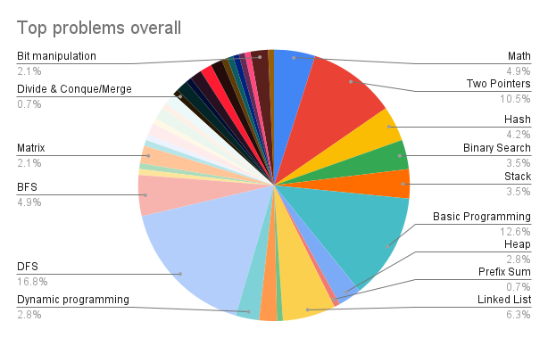
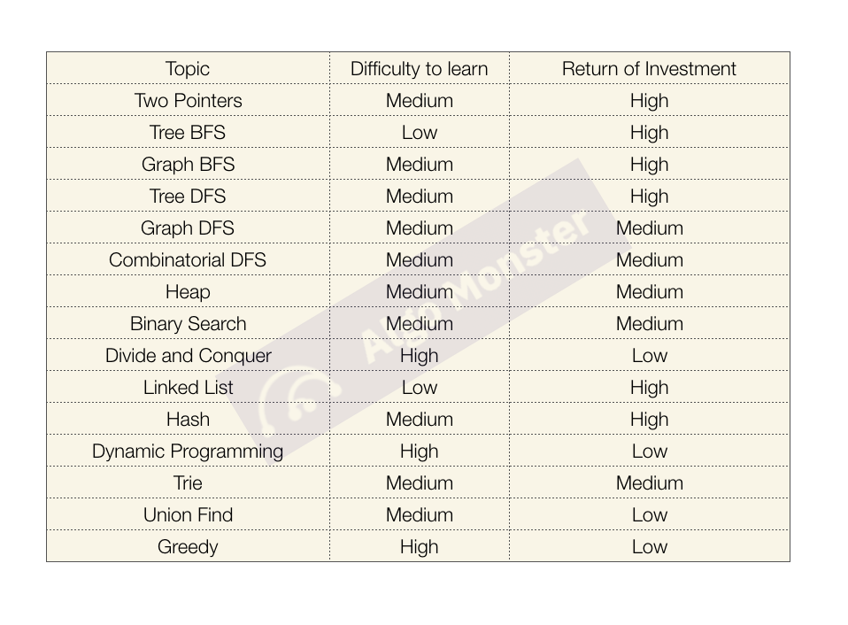

### Introduction

In the last lesson, we've covered the basic idea of common data structures and algorithms. At this point, you may be feeling confused or overwhelmed with how to start studying for technical interviews. You've written a lot of code, made some projects, but you feel that you still need more practice with solving algorithms.

There are a lot of resources for studying for technical interviews including Leetcode, Neetcode, AlgoMonster, Grokking the Coding Interview etc (more resources linked below). This lesson isn't meant to act as a substitute for the self-directed practice you may do on those websites, but rather act as a supplement or summary by providing a roadmap or general idea on how you may practice solving algorithms to confidently walk into your technical interviews.

### Lesson overview

This section contains a general overview of topics that you will learn in this lesson.

- How should I study?
- What are the most common problems?
- List of Topics
- Tips on Studying: Taking Notes, Do complexity analysis, View other solutions to improve your own
- Do Mock Interviews

### How Should I Study?

In general, there are 2 main approaches to studying/drilling on algorithm questions - by topics and by patterns. 

For instance, both Leetcode (Leetcode75) and Neetcode (Blind75, Neetcode 150) tend to break questions up into topics such as Array, Two Pointers, Stack, Queue, Linked List, etc and narrow down into specific questions under each topic. On the other hand, platforms like Grokking and AlgoMonster focus on teaching students how to learn the patterns of questions within each topic so that the pattern recognition skills can be used to solve other similar problems. 

Choosing either approach can be down to personal preference, but the most important thing is to stick to your plan, and continue practicing as that is the only way you will improve your problem solving skills.

### What are the top problems asked?
[Algomonster](https://algo.monster/problems/stats) has a great pie chart on the top problems asked.

Source: Algomonster

Based on the piechart, they have created a ROI table in terms of each topic's difficulty and return of investment. 

Source: Algomonster

Understanding the common topics and ROI can be useful to focus and narrow down topics/patterns, especially if you are short on time.

### List of Topics
A general list of topics which tend to be covered in interviews, by priority, include the following: 

High:
Array
String
Sorting and Searching
Matrix
Tree
Graph

Mid:
Hash Table
Recursion
Linked List
Queue
Stack
Heap
Interval
Tries

Low:
Dynamic Programming
Binary
Math
Geometry

### Tips on Studying: 
#### Taking Notes
Once you've chosen or come up with your own plan, it might be tempting to just go down the list and solve each problem without taking notes or documenting the issues you faced while solving the problems. 

It might be helpful to create a tracker either on Excel, Notion, Word or whatever notetaking tool you use to jot down the problems you've solved, resources you might have used to solve it (e.g. youtube videos), and challenges you have faced in the process. This [Notion](https://www.notioneverything.com/templates/100-days-of-leetcode-challenges) template is a good starting point on how you may go about doing this. Alternatively, you can refer to the excel sheet linked in the additional resources that the NeetCode founder used when practicing his problems. Taking notes is useful as you can come back to it later and review the specific things that you jotted down, and gives you a personalized list of the questions you might have struggled with and need to re-practice.

### Do Complexity Analysis
We've covered Space and Time Complexity in the previous sections. Interviewers tend to like to ask about the time and space complexity, and it would be helpful to create a column on your tracker to jot down the complexities based on your solution.

### View other solutions to improve your own
It's important to view other solutions to know how you could improve your own solution. Be sure to check out other solutions to find ways to optimize your own solution.

### Do Mock Interviews
Mock coding interviews are a great way to practice the technical portions. Interviewing.io is a great resource that pairs you with Google and Meta engineers to conduct mock interviews. Pramp is another great platform which pairs you with another job seeker where you can take turns to assume the role of interviewer and interviewee.

Of course, another way is to pair with a friend who might also be going through the same process. Either way, conducting a mock interview allows you to simulate real interviews and can help with interviewing nerves.

### Assignment

1. Create/Choose a Study Plan and stick to it
2. Practice
3. Create a tracker to track your problems solved, notes and time complexity analysis
4. View other solutions when you've come up with your own solution to think about how to optimize/improve your code.
5. Schedule some mock interview sessions

### Additional resources

This section contains helpful links to related content. It isn’t required, so consider it supplemental.

- [Excel Spreadsheet of Neetcode Videos on Leetcode 75 Questions](https://docs.google.com/spreadsheets/d/1A2PaQKcdwO_lwxz9bAnxXnIQayCouZP6d-ENrBz_NXc/edit#gid=0)
- [Udemy Master the Coding Interview: Data Structures & Algorithms Course](https://www.udemy.com/share/1013ja/)
- [Grokking the Coding Interview: Patterns for Coding Questions](https://designgurus.org/link/kJSIoU?url=https%3A%2F%2Fdesigngurus.org%2Fcourse%3Fcourseid%3Dgrokking-the-coding-interview)
- [Tech Interview Handbook Algorithms Study Cheatsheet](https://www.techinterviewhandbook.org/algorithms/study-cheatsheet/)
- [Tech Interview Grind 75](https://www.techinterviewhandbook.org/grind75)
- [Tech Interview 3 month study plan](https://www.techinterviewhandbook.org/coding-interview-study-plan/)