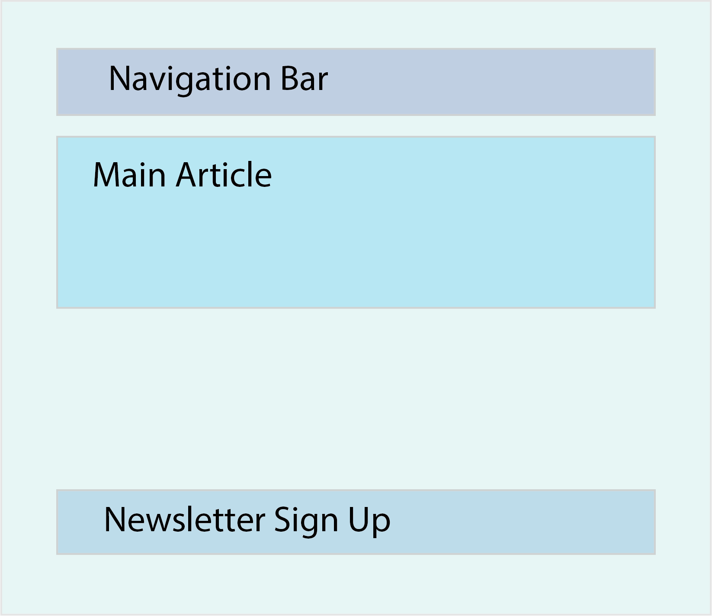

### Introduction

In this lesson we'll be going over the basics of React components - what they do, and how to write them. Make sure to use the project you set up in the [Setting Up A React Environment lesson](https://github.com/TheOdinProject/top-meta/issues/221), but try not to copy and paste any code while you're coding along. 

### Lesson Overview

This section contains a general overview of topics that you will learn in this lesson.

*   What are components?
*   How are components created?
*   Where do components live?

### What Are Components

The beauty of React is that it allows you to break a UI (User Interface) down into independent reusable chunks, which we will refer to as components. The following picture should give you an idea of how to do that when building a very basic app. 

For example, this simple website could be broken into the following components:

- `App`, which represents your main application and will be the parent of all other components.
- `Navbar`, which will be the navigation bar.
- `MainArticle`, which will be the component that renders your main content.
- `NewsletterForm`, which is a simple form that lets a user input their email to receive the weekly newsletter.

Think of these reusable chunks as JavaScript functions which can take some kind of input and return a React element.

### How To Create Components

To get the feel of working with components, we're going to practice creating functional components. What are functional components? Javascript functions! Is it really that simple? Let's have a look.

~~~jsx
function Greeting() {
  return <h1>"I swear by my pretty floral bonnet, I will end you."</h1>;
}
~~~

This might look mostly familiar to you - it's a simple JavaScript function, which returns JSX. Open up the project you were working on, create a new file named `Greeting.jsx`, and in that file write your own handmade functional component. Name it whatever you wish, have it return whatever JSX you wish. 

Are you done? Check the naming of your function! Is it capitalized? Keep this key difference in mind, components that aren't capitalized might not run as expected - which is why we capitalized `Greeting()`.

### Where Do Components Live

So remember how our component is just hanging out in its own dedicated file? This makes it independent from the rest of the codebase! That said, while independence is great, we do want the component to use functionality created elsewhere, and to share itself with other components. How can we do this? `import`ing and `export`ing! Let's import React so the component in this file works as intended. Up next, we'll want to `export` our newly created component to that parent components can use it as a child throughout your project. 

~~~jsx
import React from 'react'

function Greeting() {
  return <h1>"I swear by my pretty floral bonnet, I will end you."</h1>;
}

export default Greeting;
~~~

Are we done? Well let's think about this - we're declared our component, and exported it, but does `index.js` know about it yet? Nope! Let's fix that. Let's look at `index.js`, we can see that `root.render()` is rendering the `App` component. Let's replace that `App` component with our newly creating greeting, which we'll have to make sure is first imported properly. The end result should look something like this:

~~~jsx
import React from 'react';
import ReactDOM from 'react-dom/client';
import './index.css';
import Greeting from './greeting.js';
import reportWebVitals from './reportWebVitals';

const root = ReactDOM.createRoot(document.getElementById('root'));
root.render(
  <React.StrictMode>
    <Greeting />
  </React.StrictMode>
);

// If you want to start measuring performance in your app, pass a function
// to log results (for example: reportWebVitals(console.log))
// or send to an analytics endpoint. Learn more: https://bit.ly/CRA-vitals
reportWebVitals();
~~~

And just like that, you've successfully imported and used your first custom-made component, congratulations!

### Assignment

1.  It's time to create some new components! Use the same project, but play around with it, try displaying something like your favorite food.
    *   While components normally get exported as defaults, try using some named exports instead of default exports. If unsure of how to do this, consult your best friend - [MDN its export documentation](https://developer.mozilla.org/en-US/docs/web/javascript/reference/statements/export#description)

### Knowledge Check

This section contains questions for you to check your understanding of this lesson on your own. If you’re having trouble answering a question, click it and review the material it links to.

*   <a class="knowledge-check-link" href="#what-are-components">What does a React element look like?</a>
*   <a class="knowledge-check-link" href="#how-to-create-components">How would you create a functional component?</a>
*   <a class="knowledge-check-link" href="#where-do-components-live">How do you export and then import a component?</a>

### Additional Resources

This section contains helpful links to related content. It isn’t required, so consider it supplemental.

*   Geeks for Geeks has a quick [ReactJS Functional Components tutorial](https://www.geeksforgeeks.org/reactjs-functional-components/). It introduces some new ways of calling functional components you can play around with if you feel a burning desire to do so. For the time being don't worry too much about Class components, which the resource also goes into. 
